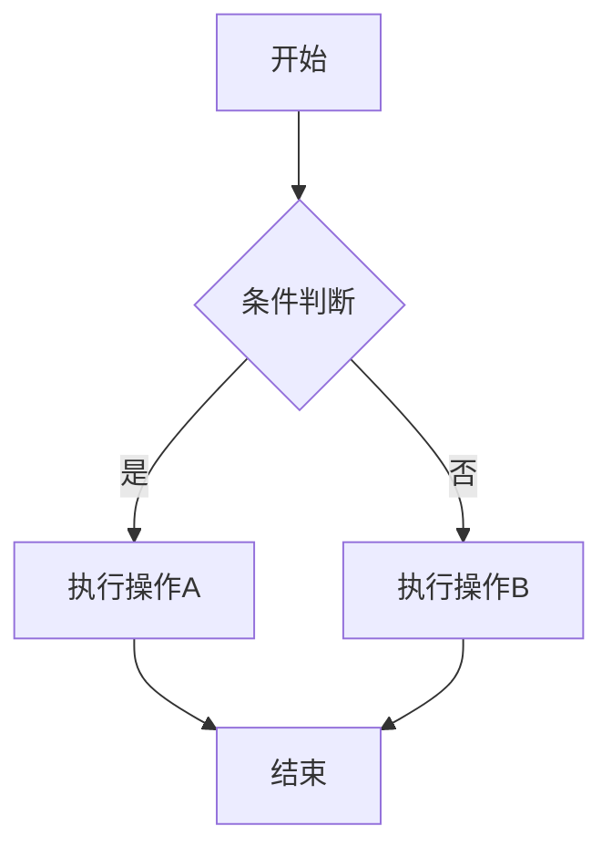
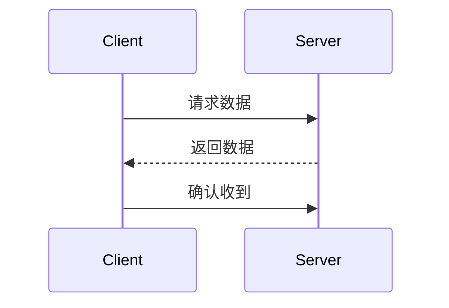
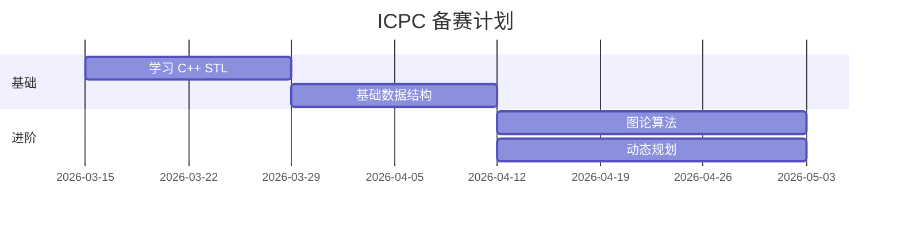
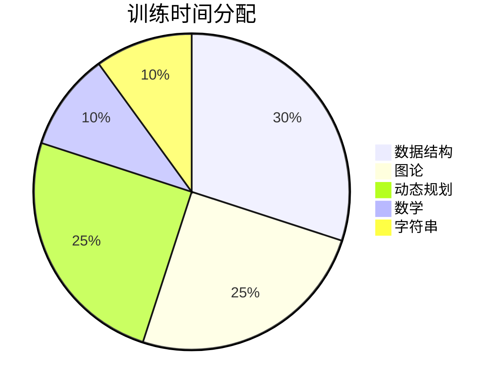

# Markdown 完全语法教程

> 这是一份从零开始的 Markdown 语法手册，涵盖所有常用语法和进阶技巧。

---

## 目录

1. [标题](#1-标题)
2. [段落与换行](#2-段落与换行)
3. [文字样式](#3-文字样式)
4. [列表](#4-列表)
5. [链接](#5-链接)
6. [图片](#6-图片)
7. [代码](#7-代码)
8. [引用](#8-引用)
9. [分隔线](#9-分隔线)
10. [表格](#10-表格)
11. [任务列表](#11-任务列表)
12. [脚注](#12-脚注)
13. [转义字符](#13-转义字符)
14. [HTML 混用](#14-html-混用)
15. [数学公式（LaTeX）](#15-数学公式latex)
16. [Mermaid 图表](#16-mermaid-图表)
17. [折叠内容](#17-折叠内容)
18. [Emoji](#18-emoji)
19. [锚点与页内跳转](#19-锚点与页内跳转)
20. [徽章 / Badge](#20-徽章--badge)
21. [实战：README 模板](#21-实战readme-模板)

---

## 1. 标题

用 `#` 号表示标题，几个 `#` 就是几级标题（1~6 级）。`#` 和文字之间要有空格。

```markdown
# 一级标题（最大）
## 二级标题
### 三级标题
#### 四级标题
##### 五级标题
###### 六级标题（最小）
```

**效果：**

> # 一级标题
> ## 二级标题
> ### 三级标题
> #### 四级标题
> ##### 五级标题
> ###### 六级标题

**替代写法（仅支持一级和二级）：**

```markdown
一级标题
========

二级标题
--------
```

**注意事项：**
- `#` 后面必须有空格，`#标题` 不会被识别
- 一个文档通常只用一个 `#` 一级标题
- 标题不要跳级，比如 `##` 后面直接用 `####` 是不好的习惯

---

## 2. 段落与换行

```markdown
这是第一段。段落之间用一个空行隔开。

这是第二段。

如果只想换行不想分段，  
在行末加两个空格再回车（叫做"软换行"）。

或者直接用 HTML 的 <br> 标签换行。
```

**关键区别：**

| 操作 | 写法 | 效果 |
|------|------|------|
| 分段 | 空一行 | 两段之间有较大间距 |
| 换行 | 行末两个空格 + 回车 | 在同一段内换行，间距小 |
| 强制换行 | `<br>` | HTML 方式换行 |

---

## 3. 文字样式

### 3.1 基础样式

```markdown
*斜体*  或  _斜体_

**粗体**  或  __粗体__

***粗斜体***  或  ___粗斜体___

~~删除线~~

`行内代码`

<u>下划线</u>（需要 HTML）

上标：X<sup>2</sup>（需要 HTML）
下标：H<sub>2</sub>O（需要 HTML）

==高亮文字==（部分平台支持，如 Obsidian）
```

**效果：**

- *斜体文字*
- **粗体文字**
- ***粗斜体文字***
- ~~删除线文字~~
- `行内代码`

### 3.2 组合使用

```markdown
这段话有 **粗体**、*斜体*、还有 `代码`，甚至 ~~删除线~~ 可以一起用。

也可以嵌套：**这是粗体里面有 *斜体* 的部分**
```

---

## 4. 列表

### 4.1 无序列表

用 `-`、`*` 或 `+` 开头，后面加空格。三种符号效果一样，推荐统一用 `-`。

```markdown
- 苹果
- 香蕉
- 橘子

* 也可以用星号
+ 也可以用加号
```

### 4.2 有序列表

用数字加 `.` 开头。实际显示的数字会自动排列，写什么数字都行（但推荐从 1 开始）。

```markdown
1. 第一步
2. 第二步
3. 第三步

1. 即使全写 1
1. 渲染出来也是
1. 1, 2, 3
```

### 4.3 嵌套列表

缩进 2 或 4 个空格即可嵌套。

```markdown
- 水果
  - 苹果
    - 红苹果
    - 青苹果
  - 香蕉
- 蔬菜
  - 西红柿
  - 黄瓜

1. 第一章
   1. 第一节
   2. 第二节
2. 第二章
   1. 第一节
```

### 4.4 列表里放段落或代码

列表项中可以包含多段文字或代码块，对齐缩进即可。

```markdown
1. 第一步：安装依赖

   这一步需要确保你有 Node.js 环境。

   ```bash
   npm install
   ```

2. 第二步：运行项目

   ```bash
   npm start
   ```
```

---

## 5. 链接

### 5.1 行内链接

```markdown
[显示文字](URL)
[Google](https://www.google.com)
[带标题的链接](https://www.google.com "鼠标悬停显示的文字")
```

**效果：** [Google](https://www.google.com)

### 5.2 引用链接（适合同一个链接多次出现）

```markdown
这里有 [Google][1] 和 [GitHub][2] 两个链接。

[1]: https://www.google.com
[2]: https://github.com
```

### 5.3 自动链接

```markdown
<https://www.google.com>
<someone@example.com>
```

直接显示为可点击的链接：<https://www.google.com>

### 5.4 页内跳转（锚点链接）

```markdown
跳转到 [标题部分](#1-标题)
```

规则：把标题转成小写，空格变 `-`，去掉特殊符号。

---

## 6. 图片

### 6.1 基本语法

```markdown


```

```markdown


```

### 6.2 图片加链接（点击图片跳转）

```markdown
[](跳转URL)
[](https://github.com)
```

### 6.3 控制图片大小（需要 HTML）

Markdown 原生不支持设定图片大小，需要用 HTML：

```html


<!-- 居中显示 -->
<div align="center">
  
</div>
```

### 6.4 引用式图片

```markdown
![替代文字][img1]

[img1]: https://example.com/image.png "标题"
```

---

## 7. 代码

### 7.1 行内代码

用单个反引号 `` ` `` 包裹。

```markdown
使用 `printf()` 函数输出内容。
变量 `n` 的值是 `42`。
```

### 7.2 代码块

用三个反引号 ` ``` ` 包裹，可以指定语言来获得语法高亮。

````markdown
```cpp
#include <iostream>
using namespace std;

int main() {
    cout << "Hello ICPC!" << endl;
    return 0;
}
```
````

**常用语言标识：**

| 标识 | 语言 |
|------|------|
| `cpp` 或 `c++` | C++ |
| `python` 或 `py` | Python |
| `java` | Java |
| `javascript` 或 `js` | JavaScript |
| `bash` 或 `shell` | Shell 脚本 |
| `sql` | SQL |
| `json` | JSON |
| `markdown` 或 `md` | Markdown |
| `html` | HTML |
| `css` | CSS |
| `diff` | Diff 对比 |
| `text` 或 `plaintext` | 纯文本 |

### 7.3 Diff 高亮（显示代码修改）

````markdown
```diff
- int ans = 0;           // 删除的行（红色）
+ long long ans = 0;     // 新增的行（绿色）
  cout << ans << endl;   // 未变的行
```
````

### 7.4 在代码块中显示反引号

外层用四个反引号包裹：

`````markdown
````markdown
```python
print("hello")
```
````
`````

---

## 8. 引用

用 `>` 开头，可以嵌套。

```markdown
> 这是一段引用文字。
> 可以跨多行。

> 也可以只写一个 `>` 号，
后续行自动属于同一引用。

> 引用可以嵌套：
>
> > 这是二级引用
> >
> > > 这是三级引用

> **引用里可以用其他 Markdown 语法**
>
> - 列表项 1
> - 列表项 2
>
> ```python
> print("代码也行")
> ```
```

**效果：**

> 这是一段引用文字。

> 引用可以嵌套：
>
> > 这是二级引用

---

## 9. 分隔线

三种写法（三个或更多），效果一样：

```markdown
---
***
___
```

**效果：**

---

**建议：** 统一使用 `---`，上下各空一行，避免和标题的替代写法冲突。

---

## 10. 表格

### 10.1 基本表格

```markdown
| 列1 | 列2 | 列3 |
|-----|-----|-----|
| A1  | B1  | C1  |
| A2  | B2  | C2  |
```

**效果：**

| 列1 | 列2 | 列3 |
|-----|-----|-----|
| A1  | B1  | C1  |
| A2  | B2  | C2  |

### 10.2 对齐方式

```markdown
| 左对齐 | 居中对齐 | 右对齐 |
|:-------|:-------:|-------:|
| 左     |   中    |     右 |
| left   | center  |  right |
```

**效果：**

| 左对齐 | 居中对齐 | 右对齐 |
|:-------|:-------:|-------:|
| 左     |   中    |     右 |
| left   | center  |  right |

**对齐规则：**
- `:---` 左对齐（默认）
- `:---:` 居中
- `---:` 右对齐

### 10.3 表格技巧

```markdown
<!-- 两边的 | 可以省略，但建议保留 -->
列1 | 列2
----|----
A   | B

<!-- 对齐不需要严格，但整齐更易读 -->
| 名字 | 分数 |
|------|------|
| 张三 | 95   |
| 李四 | 88   |

<!-- 表格中使用其他语法 -->
| 功能 | 语法 |
|------|------|
| 粗体 | `**text**` |
| 链接 | `[text](url)` |
| 代码 | `` `code` `` |
```

---

## 11. 任务列表

GitHub / GitLab / 很多 Markdown 编辑器支持。

```markdown
- [x] 已完成的任务
- [x] 学习 Markdown 基础语法
- [ ] 未完成的任务
- [ ] 刷 10 道 LeetCode 题
- [ ] 学习线段树
```

**效果：**

- [x] 已完成的任务
- [x] 学习 Markdown 基础语法
- [ ] 未完成的任务
- [ ] 刷 10 道 LeetCode 题

---

## 12. 脚注

```markdown
这里有一个脚注[^1]，还有一个更长的脚注[^longnote]。

[^1]: 这是脚注的内容。
[^longnote]: 这是一个比较长的脚注。

    可以包含多段文字，只要缩进就行。

    甚至可以包含代码块。
```

**注意：** 脚注会自动编号并显示在页面底部。GitHub 支持脚注语法。

---

## 13. 转义字符

Markdown 中有特殊含义的字符，如果想显示它们本身，前面加 `\`。

```markdown
\*这不是斜体\*
\# 这不是标题
\- 这不是列表
\[这不是链接\](也不是)
\`这不是代码\`
```

**需要转义的字符：**

```
\   反斜杠
`   反引号
*   星号
_   下划线
{}  花括号
[]  方括号
()  圆括号
#   井号
+   加号
-   减号
.   英文句点
!   感叹号
|   管道符
```

---

## 14. HTML 混用

Markdown 中可以直接写 HTML，适合实现 Markdown 不支持的排版效果。

### 14.1 文字颜色和样式

```html
<span style="color: red;">红色文字</span>
<span style="color: #3498db; font-size: 20px;">蓝色大字</span>
<mark>高亮文字</mark>
<kbd>Ctrl</kbd> + <kbd>C</kbd> 表示快捷键
```

> **注意：** GitHub 的 Markdown 不支持 `style` 属性，以上在 GitHub 上不生效。
> 但在 Typora、Obsidian、博客系统等很多地方可以使用。

### 14.2 居中和对齐

```html
<div align="center">

这段文字居中显示


</div>

<div align="right">

右对齐的文字

</div>
```

### 14.3 折叠内容（详见第 17 节）

### 14.4 表格合并（HTML 方式）

Markdown 表格不支持合并单元格，需要用 HTML：

```html
<table>
  <tr>
    <th>算法</th>
    <th>时间复杂度</th>
    <th>空间复杂度</th>
  </tr>
  <tr>
    <td rowspan="2">排序</td>
    <td>O(n log n) - 归并排序</td>
    <td>O(n)</td>
  </tr>
  <tr>
    <td>O(n log n) - 快速排序</td>
    <td>O(log n)</td>
  </tr>
  <tr>
    <td colspan="3" align="center">以上均为比较排序</td>
  </tr>
</table>
```

---

## 15. 数学公式（LaTeX）

GitHub、Obsidian、Typora 等均支持。

### 15.1 行内公式

```markdown
质能方程：$E = mc^2$

一元二次方程的解：$x = \frac{-b \pm \sqrt{b^2 - 4ac}}{2a}$
```

### 15.2 独立公式块

```markdown
$$
\sum_{i=1}^{n} i = \frac{n(n+1)}{2}
$$
```

### 15.3 常用公式速查

```markdown
上标：        $x^2$, $x^{10}$
下标：        $a_1$, $a_{ij}$
分数：        $\frac{a}{b}$
根号：        $\sqrt{n}$, $\sqrt[3]{8}$
求和：        $\sum_{i=0}^{n} a_i$
乘积：        $\prod_{i=1}^{n} i$
极限：        $\lim_{n \to \infty} \frac{1}{n}$
积分：        $\int_0^1 x^2 dx$
对数：        $\log_2 n$, $\ln n$
无穷：        $\infty$
不等号：      $\leq$, $\geq$, $\neq$, $\approx$
属于：        $\in$, $\notin$
子集：        $\subset$, $\subseteq$
交集并集：    $A \cap B$, $A \cup B$
向量：        $\vec{v}$, $\overrightarrow{AB}$
矩阵：
$$
\begin{pmatrix}
a & b \\
c & d
\end{pmatrix}
$$
分段函数：
$$
f(x) = \begin{cases}
x^2 & \text{if } x \geq 0 \\
-x  & \text{if } x < 0
\end{cases}
$$
```

### 15.4 竞赛中常用的公式

```markdown
时间复杂度表示：$O(n \log n)$, $O(n^2)$, $O(2^n)$

组合数：$\binom{n}{k} = \frac{n!}{k!(n-k)!}$

取模：$a \equiv b \pmod{m}$

向下取整 / 向上取整：$\lfloor x \rfloor$, $\lceil x \rceil$
```

---

## 16. Mermaid 图表

GitHub 和很多编辑器支持 Mermaid 语法画图。

### 16.1 流程图

````markdown

````

方向控制：`TD`（上到下）、`LR`（左到右）、`BT`（下到上）、`RL`（右到左）

### 16.2 时序图

````markdown

````

### 16.3 甘特图

````markdown

````

### 16.4 饼图

````markdown

````

---

## 17. 折叠内容

使用 HTML 的 `<details>` 标签（GitHub 支持）。

```markdown
<details>
<summary>点击展开/收起</summary>

这里是被折叠的内容。

可以包含 **Markdown** 语法。

```cpp
int main() {
    return 0;
}
```

</details>
```

**常见用法：题目的参考答案折叠：**

```markdown
### 题目：两数之和

给定一个数组和一个目标值，找出数组中和为目标值的两个数。

<details>
<summary>💡 提示</summary>

考虑用哈希表来降低时间复杂度。

</details>

<details>
<summary>✅ 参考代码</summary>

```cpp
vector<int> twoSum(vector<int>& nums, int target) {
    unordered_map<int, int> mp;
    for (int i = 0; i < nums.size(); i++) {
        int complement = target - nums[i];
        if (mp.count(complement)) {
            return {mp[complement], i};
        }
        mp[nums[i]] = i;
    }
    return {};
}
```

</details>
```

---

## 18. Emoji

### 18.1 快捷码方式（GitHub 支持）

```markdown
:smile:  :thumbsup:  :rocket:  :fire:  :star:
:warning:  :bulb:  :memo:  :bug:  :white_check_mark:
```

### 18.2 直接粘贴 Unicode Emoji

```markdown
😀 👍 🚀 🔥 ⭐ ⚠️ 💡 📝 🐛 ✅
```

**常用 Emoji 速查：**

| Emoji | 快捷码 | 用途 |
|-------|--------|------|
| ⚠️ | `:warning:` | 警告、注意事项 |
| ✅ | `:white_check_mark:` | 已完成 |
| ❌ | `:x:` | 错误、未完成 |
| 💡 | `:bulb:` | 提示、灵感 |
| 🚀 | `:rocket:` | 性能、发布 |
| 🐛 | `:bug:` | Bug |
| 📝 | `:memo:` | 笔记 |
| 🔧 | `:wrench:` | 配置、修复 |

---

## 19. 锚点与页内跳转

### 19.1 自动生成的锚点

每个标题都会自动生成一个锚点 ID，规则如下：
1. 转小写
2. 空格变 `-`
3. 去掉特殊符号（`()`、`.` 等）
4. 中文保留

```markdown
## My Cool Section
<!-- 锚点 ID：#my-cool-section -->

## 3.1 基础样式
<!-- 锚点 ID：#31-基础样式 -->

跳转方法：[点击跳到某节](#my-cool-section)
```

### 19.2 手动锚点（HTML）

```markdown
<a id="custom-anchor"></a>

... 很多内容 ...

[跳转到自定义锚点](#custom-anchor)
```

---

## 20. 徽章 / Badge

GitHub README 中常见的标签，使用 [shields.io](https://shields.io) 生成。

```markdown


```

自定义徽章格式：
```
https://img.shields.io/badge/标签-内容-颜色
```

---

## 21. 实战：README 模板

下面是一个完整的 GitHub 项目 README 模板：

```markdown
# 项目名称 🚀


> 一句话描述你的项目。

## 📋 目录

- [功能](#功能)
- [安装](#安装)
- [使用](#使用)
- [贡献](#贡献)

## ✨ 功能

- [x] 功能 A
- [x] 功能 B
- [ ] 功能 C（开发中）

## 🔧 安装

​```bash
git clone https://github.com/你的用户名/项目名.git
cd 项目名
make
​```

## 📖 使用

​```cpp
#include "solution.h"

int main() {
    Solution sol;
    cout << sol.solve(input) << endl;
}
​```

## 🤝 贡献

1. Fork 本项目
2. 创建你的分支 (`git checkout -b feature/amazing`)
3. 提交修改 (`git commit -m 'Add amazing feature'`)
4. 推送分支 (`git push origin feature/amazing`)
5. 发起 Pull Request

## 📄 许可证

本项目采用 [MIT](LICENSE) 许可证。
```

---

## 附录：Markdown 符号速查表

| 功能 | 语法 | 示例 |
|------|------|------|
| 标题 | `# ~ ######` | `## 二级标题` |
| 粗体 | `**text**` | **粗体** |
| 斜体 | `*text*` | *斜体* |
| 粗斜 | `***text***` | ***粗斜体*** |
| 删除线 | `~~text~~` | ~~删除线~~ |
| 行内代码 | `` `code` `` | `code` |
| 代码块 | ```` ```lang ```` | 见第 7 节 |
| 链接 | `[text](url)` | [链接](url) |
| 图片 | `` | 见第 6 节 |
| 引用 | `> text` | > 引用 |
| 无序列表 | `- item` | 见第 4 节 |
| 有序列表 | `1. item` | 见第 4 节 |
| 任务列表 | `- [x] done` | 见第 11 节 |
| 表格 | `\| a \| b \|` | 见第 10 节 |
| 分隔线 | `---` | 见第 9 节 |
| 脚注 | `[^1]` | 见第 12 节 |
| 转义 | `\*` | \* |
| 数学公式 | `$E=mc^2$` | 见第 15 节 |
| Emoji | `:smile:` | 😄 |
| 折叠 | `<details>` | 见第 17 节 |

---

> **提示：** 不同平台（GitHub、Obsidian、Typora、VS Code）对 Markdown 的支持程度略有不同。  
> 核心语法（标题、列表、链接、代码、表格）到处都通用。  
> 扩展语法（Mermaid、数学公式、脚注）需要看具体平台是否支持。
