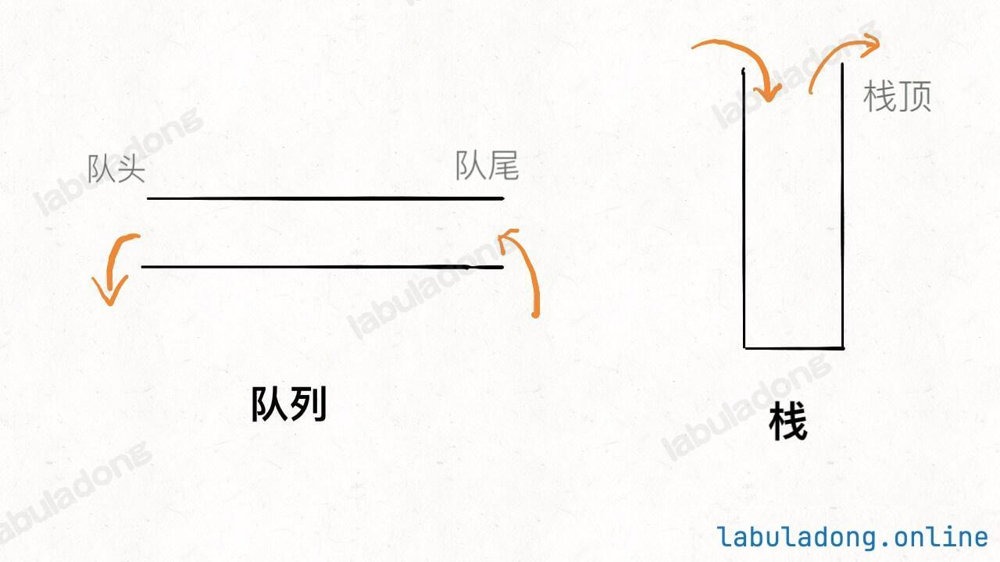

# 队列和栈基本原理

> 前置知识：数组（顺序存储）基础、链表（链式存储）基础

---

## 目录

1. [什么是「操作受限」的数据结构](#1-什么是操作受限的数据结构)
2. [队列](#2-队列)
3. [栈](#3-栈)
4. [基本API](#4-基本api)
5. [总结](#5-总结)

---

## 1. 什么是「操作受限」的数据结构

前面学的数组和链表，可以对**任意位置**的元素进行增删查改：

```cpp
arr[3] = 99;           // 随便改任意索引
arr.insert(2, 666);    // 随便在任意位置插入
arr.erase(5);          // 随便删任意位置
```

队列和栈是在数组/链表的基础上，**故意删掉了大部分操作，只保留特定的几个**。

```
数组/链表：可以操作任意位置
队列：     只能在一端插入，另一端删除
栈：       只能在同一端插入和删除
```

**为什么要「限制」操作？**

限制操作不是缺点，而是刻意设计的。有些场景只需要特定的访问模式，限制操作可以：

- 防止误操作
- 让代码意图更清晰
- 底层实现可以针对性地优化



---

## 2. 队列

### 特点：先进先出（FIFO）

队列就像**排队买奶茶**：

```
入队（队尾插入）：新来的排到最后
出队（队头删除）：排在最前面的先离开

队头                        队尾
 ↓                           ↓
[先来的] → [  ] → [  ] → [后来的]
  ↑ 出队                      ↑ 入队
```

操作示例：

```
初始：空队列 []

push(1)：[1]
push(2)：[1, 2]
push(3)：[1, 2, 3]

pop()：返回1，队列变成 [2, 3]   ← 先进来的1先出去
pop()：返回2，队列变成 [3]
peek()：返回3，但不删除，队列还是 [3]
```

---

## 3. 栈

### 特点：先进后出（LIFO）

栈就像**一摞盘子**：

```
只能从顶部操作（放入/取出）

    ↑ push/pop 都在这里
  ┌─────┐
  │  3  │  ← 最后放的，最先被取走
  ├─────┤
  │  2  │
  ├─────┤
  │  1  │  ← 最先放的，最后被取走
  └─────┘
```

操作示例：

```
初始：空栈 []

push(1)：[1]
push(2)：[1, 2]
push(3)：[1, 2, 3]

pop()：返回3，栈变成 [1, 2]   ← 最后进来的3先出去
pop()：返回2，栈变成 [1]
peek()：返回1，但不删除，栈还是 [1]
```

---

## 4. 基本API

队列和栈的 API 完全一样，只是行为不同：

```cpp
// 队列
template<typename E>
class MyQueue {
public:
    void push(const E& e);  // 向队尾插入元素，O(1)
    E pop();                // 从队头删除并返回元素，O(1)
    E peek() const;         // 查看队头元素（不删除），O(1)
    int size() const;       // 返回元素个数，O(1)
};

// 栈
template<typename E>
class MyStack {
public:
    void push(const E& e);  // 向栈顶插入元素，O(1)
    E pop();                // 从栈顶删除并返回元素，O(1)
    E peek() const;         // 查看栈顶元素（不删除），O(1)
    int size() const;       // 返回元素个数，O(1)
};
```

> 两个问题分开讲。
>
> ---
>
> # 第一个问题：`const E& e` 里的 `&` 为什么在 E 后面
>
> 这里的 `&` 是 **引用** ，声明参数是引用类型。
>
> 你之前学过，`&` 在类型后面就是引用：
>
> ```cpp
> int &ref = a;      // & 在类型后面，声明引用
> void func(int &x)  // 参数也是一样，& 跟着类型
> ```
>
> 所以 `const E& e` 就是 `const E &e`，两种写法完全等价：
>
> ```cpp
> void push(const E& e);   // & 靠近类型，常见写法
> void push(const E &e);   // & 靠近变量名，也对
> ```
>
> 就像之前讲指针时说的：
>
> ```cpp
> int* p;   // * 靠近类型
> int *p;   // * 靠近变量名
> // 两种写法完全一样，只是风格不同
> ```
>
> ---
>
> # 第二个问题：`const` 是什么
>
> 这里有两个地方出现了 `const`，含义不一样：
>
> ---
>
> ## ① 参数里的 const：`const E& e`
>
> 意思是：**这个参数传进来后，函数内部不能修改它。**
>
> ```cpp
> void push(const E& e) {
>     e = 999;  // ❌ 报错！const 参数不能修改
> }
> ```
>
> **为什么要加 const？**
>
> `push` 函数只是把 `e` 插入队列，不需要修改它。加 `const` 是一种承诺：
>
> ```
> "我保证只读这个参数，不会改它"
> ```
>
> 这样调用者就放心了，传进去的数据不会被意外修改。
>
> ---
>
> ## ② 函数后面的 const：`E peek() const`
>
> 意思是：**这个函数不会修改类的任何成员变量。**
>
> 就是上次讲过的 **常量成员函数** ：
>
> ```cpp
> E peek() const {
>     size++;  // ❌ 报错！const 函数不能修改成员变量
>     return data;  // ✅ 只读，没问题
> }
> ```
>
> `peek` 只是看一下队头元素，不删除也不修改任何东西，所以加 `const` 表示"我保证只读，不写"。
>
> ---
>
> # 对比两种 const 的位置
>
> ```cpp
> void push(const E& e);   // const 在参数前：参数不可修改
> E peek() const;          // const 在函数后：成员变量不可修改
> ```
>
> ---
>
> # 一句话总结
>
> ```
> const E& e     → 传引用（不复制），但保证不修改传入的值
> E peek() const → 这个函数只读数据，保证不修改类的成员变量
>
> 两个 const 位置不同，保护的对象也不同：
>   参数前的 const → 保护传入的参数
>   函数后的 const → 保护类自己的成员变量
> ```

**push 和 pop 的区别：**

|               |   队列   |     栈     |
| ------------- | :------: | :--------: |
| push 插入位置 |   队尾   |    栈顶    |
| pop 删除位置  |   队头   |    栈顶    |
| 规律          | 两端操作 | 同一端操作 |

**peek 和 pop 的区别：**

```
pop()：取出元素，同时删除它
peek()：只看一眼，不删除

就像奶茶店：
pop  = 队头的人买完离开
peek = 只是看看队头是谁，人还在
```

### C++ STL 中的对应

```cpp
#include <queue>
#include <stack>

// 队列
queue<int> q;
q.push(1);    // 入队
q.pop();      // 出队（无返回值）
q.front();    // 查看队头（相当于peek）
q.size();

// 栈
stack<int> s;
s.push(1);    // 入栈
s.pop();      // 出栈（无返回值）
s.top();      // 查看栈顶（相当于peek）
s.size();
```

> ⚠️ C++ STL 的 `pop()` 没有返回值，需要先用 `front()`/`top()` 取值，再用 `pop()` 删除。

---

## 5. 总结

```
队列和栈都是「操作受限」的数据结构
底层还是数组或链表实现的，只是限制了可以用哪些操作

队列：先进先出（FIFO）
      只能队尾入，队头出
      类比：排队

栈：  先进后出（LIFO）
      只能栈顶入，栈顶出
      类比：一摞盘子

两者的API：push（插入）/ pop（删除）/ peek（查看）/ size（大小）
```

**竞赛中的使用场景：**

| 数据结构 | 典型场景                              |
| -------- | ------------------------------------- |
| 队列     | BFS（广度优先搜索）                   |
| 栈       | DFS（深度优先搜索）、括号匹配、单调栈 |

> 📌 **下一章**：用链表分别实现队列和栈的完整代码。
