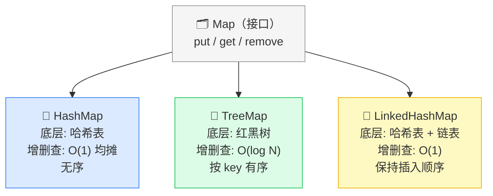
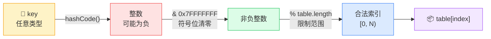
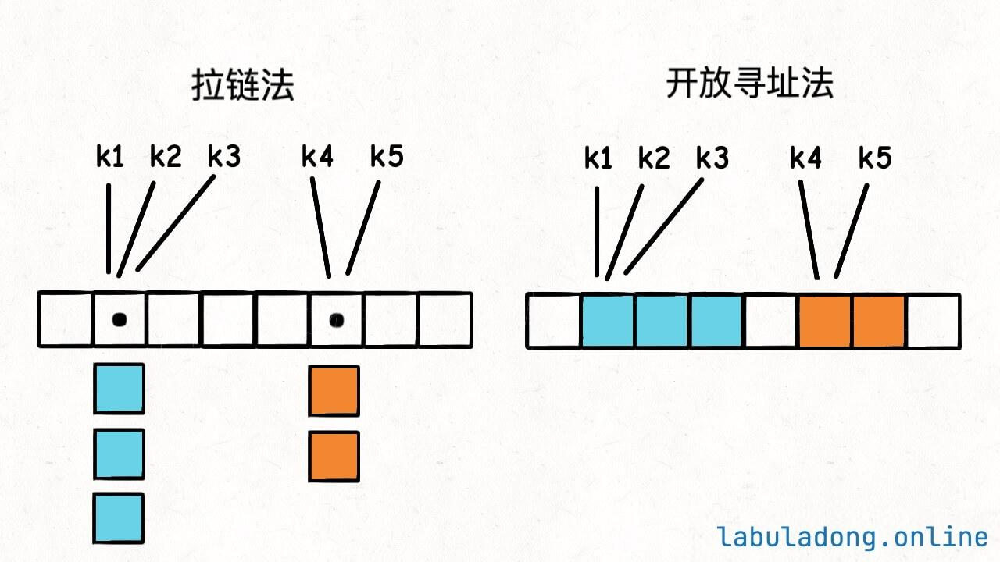
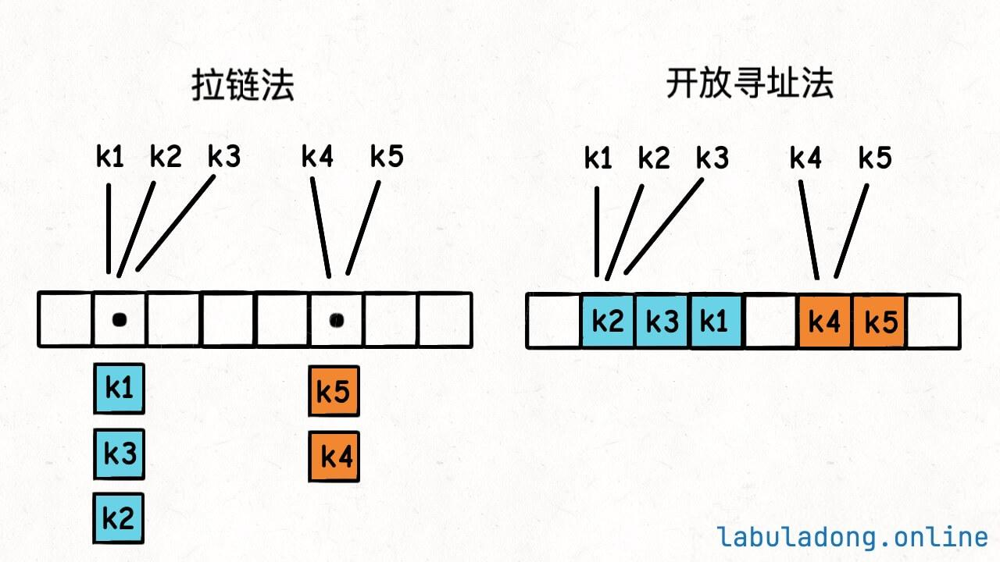
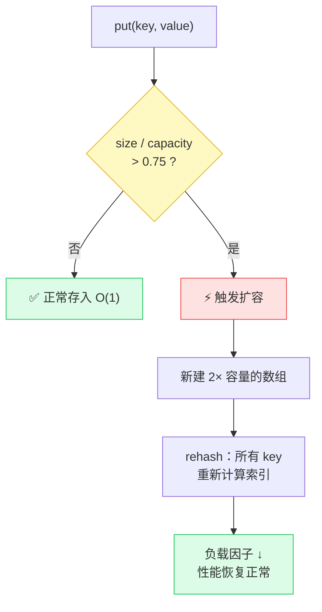

# 哈希表核心原理 — 学习笔记

---

## 一、先搞清一个概念：哈希表 ≠ Map

很多人把「哈希表」和「Map（键值映射）」混为一谈，这是不对的。

**Map 是一种"接口"（规范）**，它只规定了"我要能存键值对、能查、能删"，但没说底层怎么实现。接口的概念对初学者来说有点抽象——你可以把它理解成一份"合约"：任何签了这份合约的类，都保证提供这些操作，但每家实现方式可以完全不同。学了这个区别，你以后看到 TreeMap、LinkedHashMap 就不会迷糊了。

**哈希表（HashMap）是 Map 的一种具体实现方式**，它用哈希函数来实现这些操作，所以增删查改都是 O(1)。注意这里说的是"均摊 O(1)"——绝大多数情况下是 O(1)，极端情况会退化，后面会讲到。

但 Map 还有其他实现方式，比如：

- **TreeMap**：底层用二叉搜索树，增删查改是 O(log N)。慢一些，但它能保证 key 有序，这是哈希表做不到的。
- **LinkedHashMap**：在哈希表基础上加了链表，能保持插入顺序。速度和哈希表一样，只是额外记住了"谁先来"。

> **类比**：Map 就像"交通工具"这个概念，而 HashMap 就像"汽车"。你不能说所有交通工具都跟汽车一样快，自行车也是交通工具，但速度完全不同。

**结论**：听到"键值对操作是 O(1)"时，要确认底层是不是哈希表实现的，不能一概而论。



> ✅ 把 Map 和 HashMap 区分清楚，这是理解整个哈希表体系的第一步，很多同学在这里就绕糊涂了，你已经比他们走得更稳。

---

## 二、哈希表的基本原理

### 核心思想：哈希表 = 加强版数组

- **普通数组**：用整数索引（0, 1, 2, ...）在 O(1) 时间内找到元素
- **哈希表**：用任意类型的 key（字符串、数字等）在 O(1) 时间内找到对应的 value

普通数组之所以能 O(1) 访问，是因为索引直接就是内存偏移量——CPU 直接跳过去就行，不用搜索。哈希表要把字符串、对象等复杂 key 也做到这一点，解决办法就是"先翻译"：把任意 key 转成一个整数，再当做数组索引用。

怎么做到的？**把 key 通过一个「哈希函数」转化成数组索引**，然后就跟操作数组一样了。翻译这一步是整个哈希表的核心，所有性能特性都从这里来。

> **类比**：想象一个图书馆。普通数组就像书架上的编号（第1本、第2本...），你直接按编号找书。哈希表就像图书馆的检索系统——你输入书名（key），系统告诉你去第几号书架（索引），然后你直接去那个书架拿书（value）。

```text
  key "apple"  ──┐
  key "banana" ──┼──→  hash()  ──→  合法索引  ──→  table[index]
  key "cherry" ──┘

  底层数组 table（长度 = 16）：
  ┌───┬───┬───┬──────────┬───┬───┬───┬───┬───┬──────────┬───┬───┬───┬───┬─────────┬───┐
  │ 0 │ 1 │ 2 │    3     │ 4 │ 5 │ 6 │ 7 │ 8 │    9     │...│   │   │   │   14    │15 │
  │   │   │   │ "banana" │   │   │   │   │   │ "cherry" │   │   │   │   │ "apple" │   │
  └───┴───┴───┴──────────┴───┴───┴───┴───┴───┴──────────┴───┴───┴───┴───┴─────────┴───┘
                  ↑ index=3                      ↑ index=9                  ↑ index=14
```

### 伪代码逻辑

```cpp
class MyHashMap {
private:
    vector<void*> table;  // 底层就是一个数组

public:
    // 存入 / 修改：算出索引，直接放进去
    void put(auto key, auto value) {
        int index = hash(key);
        table[index] = value;
    }

    // 查询：算出索引，直接取
    auto get(auto key) {
        int index = hash(key);
        return table[index];
    }

    // 删除：算出索引，置空
    void remove(auto key) {
        int index = hash(key);
        table[index] = nullptr;
    }

private:
    // 哈希函数：把 key 转化成数组的合法索引
    // 这个函数必须是 O(1) 的！
    int hash(auto key) {
        // ...
    }
};
```

**关键点**：所有操作都依赖 `hash()` 函数。如果这个函数是 O(1) 的，那增删查改就都是 O(1)。反过来也成立——如果 `hash()` 变慢了，整张哈希表的性能都会跟着跌。这就是为什么哈希函数的设计是重中之重。

> 💡 **老师提醒：** 上面的伪代码忽略了哈希冲突——两个不同 key 算出相同 index 时，直接覆盖就把旧数据丢了。真实实现需要处理冲突，第四节会详细讲。伪代码的目的是先把"哈希表 = 带翻译层的数组"这个骨架刻进脑子里。

---

## 三、几个关键概念

### 3.1 key 唯一，value 可重复

跟数组类比就很好理解：

- 数组里不可能有两个索引 0 → 哈希表里不可能有两个相同的 key
- 数组里多个位置可以存相同的值 → 哈希表里多个 key 可以对应相同的 value

"key 唯一"在实际使用中意味着：如果你对同一个 key 调用两次 `put()`，第二次会覆盖第一次的 value，而不是追加。这和数组的赋值语义完全一致——`arr[0] = 5; arr[0] = 10;` 最终只剩 10。

> 💡 **老师提醒：** 竞赛里很常见的 bug——以为同一个 key `put` 两次能存两条记录。不行的，后者覆盖前者。如果你需要一个 key 对应多个 value，应该用 `unordered_map<key, vector<value>>`，把多个值塞进一个 vector 里。

### 3.2 哈希函数

哈希函数的职责：**把任意类型的 key 转化成数组的合法索引**。

两个核心要求：

1. **时间复杂度必须是 O(1)**，否则整个哈希表的性能就会退化。这条要求说起来简单，其实隐含了一个约束：key 的哈希计算不能遍历 key 自身的所有元素，否则 key 越大，哈希越慢。
2. **相同的输入必须产生相同的输出**（确定性）。不能说这次 `hash("abc") = 5`，下次 `hash("abc") = 8`。违反这条就什么都找不到了——存和查用的不是同一个地址。

#### 如何把 key 转化成整数？

以 Java 为例，每个对象都有 `hashCode()` 方法，默认返回一个基于内存地址的整数。其他语言也有类似机制。C++ 中是 `std::hash<T>{}(key)`，标准库已经为 `int`、`string` 等常见类型提供了实现，你直接用就行，不需要自己写。

#### 如何保证索引合法？

两个问题要处理：

**问题1：hashCode 可能是负数**

```java
int h = key.hashCode();
// 错误做法：直接取反
// 如果 h = -2^31（int 最小值），-h 会整型溢出！

// 正确做法：用位运算把符号位清零
h = h & 0x7fffffff;
// 0x7fffffff 的二进制 = 0111 1111 ... 1111
// & 运算后，最高位（符号位）变成 0，保证 h 非负
```

**问题2：hashCode 值可能很大，超出数组范围**

```java
// 用取模运算，让索引落在 [0, table.length) 范围内
return h % table.length;
```

> **类比**：取模就像"绕圈"。如果你的停车场有 10 个车位（编号 0-9），车牌号是 12345，那 12345 % 10 = 5，这辆车就停在 5 号车位。
> 💡 **老师提醒：** 为什么用 `& 0x7fffffff` 而不用 `abs()` 取绝对值？因为 `int` 最小值 `-2^31` 取绝对值后结果仍然是 `-2^31`（整型溢出，C++ 里是未定义行为）。位运算则直接把符号位清零，永远安全。这是一个很经典的"看似简单其实有坑"的地方。

#### 完整的哈希函数

```java
int hash(K key) {
    int h = key.hashCode();
    h = h & 0x7fffffff;    // 保证非负
    return h % table.length; // 映射到合法索引
}
```

#### 哈希函数三步流程



> ✅ 哈希函数三步走：整数化 → 非负化 → 范围限制。把这三步记牢，以后自己实现哈希表时不会在这里出错。

---

## 四、哈希冲突

### 4.1 什么是哈希冲突？

两个不同的 key，经过哈希函数计算后得到了**相同的索引**，这就叫哈希冲突。冲突不意味着数据丢失——只是两个 key "想住同一间屋子"，需要一套规则来安排它们共存或分开。

### 4.2 哈希冲突能避免吗？

**不能！** 因为哈希函数是把无穷大的 key 空间映射到有限的索引空间，必然会有不同的 key 撞到同一个位置。这是数学上的必然，叫"鸽巢原理"——鸽子比笼子多，必然有鸽子共笼。

> **类比**：就像把全中国 14 亿人按生日分成 365 组，肯定会有很多人分到同一组——位置就那么多，人那么多，撞车是必然的。

### 4.3 解决哈希冲突的两种方法

*就像"同一个格子往上摞"和"找旁边的空格子"的区别*——拉链法选择前者，冲突的元素都挂在同一格子的链表里往纵向延伸；线性探查法选择后者，冲突了就扫描后面的空位往横向延伸。两种方法各有取舍，下面分别看。

#### 方法一：拉链法（Chaining）

**思路**：数组的每个位置不直接存 value，而是存一个**链表**。多个 key 映射到同一个索引时，它们的 key-value 对都挂在这个链表上。

> **类比**：停车场的每个车位变成了一条车道，如果多辆车被分配到同一个位置，它们就排成一列停在这条车道上。

- 查找时：先算出索引，再遍历链表找到目标 key
- 链表越长，查找越慢

链表变长意味着"冲突越来越严重"——这就是为什么需要负载因子和扩容机制来控制链表的平均长度，让它维持在接近 1 的常数，而不是随着元素增多无限变长。

#### 方法二：线性探查法 / 开放寻址法（Open Addressing）

**思路**：如果算出来的索引已经被占了，就往后挨个找，直到找到一个空位。

> **类比**：你去停车场，分配到的 5 号车位被占了，那就看 6 号，6 号也满了就看 7 号……直到找到一个空车位。

**示例**：假设插入顺序是 k2, k4, k5, k3, k1：

- k2 先插入，放到它的哈希位置
- k4 插入，放到它的哈希位置
- k5 和 k4 冲突了，往后挪一位
- k3 和 k2 冲突了，往后挪一位
- k1 和 k2、k3 都冲突了，继续往后挪

最终效果就像图中展示的那样：拉链法向"纵向"延伸（链表），开放寻址法向"横向"延伸（数组后面的空位）。

**拉链法（Chaining）示意：**

```text
index │  table   │  链表
──────┼──────────┼──────────────────────────────────
  0   │  [ • ]──→│  null
  1   │  [ • ]──→│  (k1, v1) → null
  2   │  [ • ]──→│  (k2, v2) → (k3, v3) → null   ← k2 与 k3 冲突！
  3   │  [ • ]──→│  (k4, v4) → null
  4   │  [ • ]──→│  (k5, v5) → (k6, v6) → null   ← k5 与 k6 冲突！
  5   │  [ • ]──→│  null
```

**线性探查法（Open Addressing）示意：**

```text
插入顺序：k2(hash=1), k4(hash=3), k5(hash=3), k3(hash=1), k1(hash=1)

        index:  0     1     2     3     4     5     6     7
               ┌───┬─────┬─────┬─────┬─────┬─────┬─────┬───┐
初始状态：      │   │     │     │     │     │     │     │   │
               └───┴─────┴─────┴─────┴─────┴─────┴─────┴───┘

插入 k2(hash=1)  │   │ k2  │     │     │     │     │     │   │  → 直接放 index=1
插入 k4(hash=3)  │   │ k2  │     │ k4  │     │     │     │   │  → 直接放 index=3
插入 k5(hash=3)  │   │ k2  │     │ k4  │ k5  │     │     │   │  → 3 被占，移到 4
插入 k3(hash=1)  │   │ k2  │ k3  │ k4  │ k5  │     │     │   │  → 1 被占，移到 2
插入 k1(hash=1)  │   │ k2  │ k3  │ k4  │ k5  │ k1  │     │   │  → 1,2,3,4 被占，移到 5
               └───┴─────┴─────┴─────┴─────┴─────┴─────┴───┘
```

> 💡 **老师提醒：** 线性探查法有一个副作用叫"聚集效应"——被占的位置越来越连片，后来的元素要探查的步数越来越多。k1 插入时已经要跳过 4 个位置了。这就是为什么线性探查法要求负载因子必须严格小于 1，接近满时性能急剧下降。





> ✅ 两种冲突解决方法都理解了。拉链法好实现，开放寻址法内存更紧凑。下一篇专讲两者的具体代码实现，现在先把思路刻进脑子里。

---

## 五、扩容和负载因子

### 5.1 为什么需要扩容？

哈希冲突越多，性能越差。而冲突变多的一个重要原因就是：**哈希表装太满了**。装满的本质是：元素数量增加，但格子数量不变，每个格子平均要分担的元素变多了——拉链法里链表变长，线性探查法里连续被占的区段变长，查找步数都会增加。扩容就是在性能下降前，主动把格子数量增加，让每个格子重新变得"稀疏"。

### 5.2 什么是负载因子？

负载因子衡量的是哈希表有多"拥挤"：

```text
负载因子 = size / table.length
```

- `size`：当前存了多少个 key-value 对
- `table.length`：底层数组的容量

负载因子是一个 0 到 1（拉链法可以超过 1）之间的小数，越接近 1 说明越拥挤，冲突越频繁，查找越慢。

> **类比**：负载因子就像停车场的使用率。100 个车位停了 75 辆车，使用率就是 0.75。使用率越高，你找到空车位就越难。

### 5.3 不同方法的负载因子特点

- **拉链法**：负载因子可以大于 1（因为链表可以无限延伸）。但"可以大于 1"不代表应该让它大于 1——大于 1 意味着平均每条链表超过 1 个节点，查找不再是 O(1)。
- **线性探查法**：负载因子不会超过 1（数组位置用完就没了）。而且不能等到接近 1 才扩容——负载因子 0.8 的线性探查表，冲突已经非常严重了。

*就像"停车场加了隔板能再停车"和"停车场真的满了只能排队等位"的区别*——拉链法通过链表给每个格子加了无限容量，线性探查法格子满了就真的满了。

### 5.4 扩容机制

Java 的 HashMap 默认负载因子是 **0.75**（经验值）。

当元素数量达到 `容量 × 0.75` 时，就触发扩容：

1. 创建一个更大的新数组（通常是原来的 2 倍）
2. 把所有元素用哈希函数重新计算索引，搬到新数组中
3. `size` 不变，`table.length` 增大，负载因子就降下来了

第 2 步的"重新计算索引"叫 **rehash**，这是扩容最重要也最容易忽视的步骤。容量变了，`hash(key) = hashCode % table.length` 的结果就变了，原来在格子 3 的 key，扩容后可能跑到格子 11，所以每个元素都必须重新放置，不能直接复制数组。



> 💡 **老师提醒：** 扩容是 O(N) 的——要遍历所有 N 个元素重新 hash。但因为触发扩容的频率很低（每次扩容后要再加很多元素才会再次触发），均摊下来每次插入的扩容代价是 O(1)。这就是为什么说哈希表是"均摊 O(1)"而不是严格 O(1)。
> ✅ 负载因子 + 扩容 = 哈希表性能的守护机制。理解了这两个概念，你就明白为什么哈希表能把 O(1) 维持得那么稳定了。

---

## 六、重要注意事项

### 6.1 不能依赖哈希表的遍历顺序

哈希表中 key 的遍历顺序是**无序的、不稳定的**。

原因有两个：

1. key 在底层数组中的位置由哈希函数决定，分布是"随机"的。字符串 "apple" 可能被放到索引 14，"banana" 被放到索引 3——遍历数组时自然是 "banana" 先出现，和插入顺序无关。
2. 扩容会导致所有 key 重新计算索引，位置会变化。扩容前遍历是 A、B、C 的顺序，扩容后可能变成 B、C、A。

> **类比**：就像你把书扔进箱子里，每次搬家（扩容）书的排列顺序都会变。你不能指望每次打开箱子，书都按你上次看到的顺序排着。
> 💡 **老师提醒：** 如果你需要按 key 的大小顺序遍历，改用 `map`（C++）或 `TreeMap`（Java），它们底层是红黑树，遍历出来的顺序就是 key 的升序。用哈希表只是因为你不关心顺序但要 O(1) 速度。

### 6.2 不要在遍历时增删 key

遍历哈希表本质上是遍历底层数组。如果一边遍历一边增删元素：

- 增删可能触发扩容，整个数组都变了，遍历就乱套了
- 新插入/删除的元素，该不该被遍历到？行为不确定

**这个问题不只是哈希表的，任何数据结构都不建议在遍历中同时增删。**

> 💡 **老师提醒：** 竞赛里如果需要"遍历并删除满足条件的 key"，正确做法是先遍历一遍，把要删除的 key 收集进一个 `vector`，遍历结束后再统一删除。两步走，绝不在遍历中直接删。

### 6.3 key 必须是不可变的

**什么是不可变类型？** 对象一旦创建，它的值就不能再改变。

- 不可变类型的例子：`string`, `int`
- 可变类型的例子：`vector`, `list`

**为什么 key 必须不可变？**

因为哈希表所有操作都依赖 `hash(key)` 的返回值。如果 key 的内容变了，hash 值也会变，之前存进去的数据就**找不到了**。

```
// 错误示例（Java）
ArrayList<Integer> arr = {1, 2};
map.put(arr, 999);          // hash(arr) = X，存在位置 X
map.get(arr);               // hash(arr) = X，找到了，返回 999

arr.add(3);                 // arr 变了！
map.get(arr);               // hash(arr) = Y（Y ≠ X），找不到了！返回 null
// 但数据实际上还在位置 X，只是你再也找不到它了
// 这就是内存泄漏 + 数据丢失
```

> **类比**：你把钱存在保险柜里，密码是根据你的名字算出来的。后来你改名了，用新名字算出的密码当然打不开保险柜——钱还在里面，但你拿不到了。
> 💡 **老师提醒：** 在 C++ 中，`unordered_map` 的 key 类型必须满足两个条件：能计算哈希值（有 `std::hash` 特化），且能用 `==` 比较相等。`string`、`int`、`char` 等都满足；`vector<int>` 默认不满足，你需要自己提供哈希函数才能用。在实际竞赛中，这个限制很少碰到问题，因为 key 通常是整数或字符串。

**另一个问题**：可变类型（如 ArrayList）的 hashCode 要遍历所有元素才能算出来，复杂度是 O(N)，这会让哈希表的操作从 O(1) 退化成 O(N)。

**不可变类型（如 String）** 的 hashCode 只需要算一次，之后缓存起来，后续直接用缓存值，平均时间复杂度还是 O(1)。

> ✅ 三条注意事项：顺序不可依赖、遍历中不可增删、key 必须不可变。记住这三条，用哈希表就不会踩坑。

---

## 七、总结 & 面试常见问题

### Q1：为什么哈希表的增删查改是 O(1)？

因为底层就是操作数组，只要：

1. 哈希函数计算索引的复杂度是 O(1)
2. 合理控制哈希冲突（负载因子 + 扩容）

那所有操作就是 O(1)。两个条件缺一不可。光有好的哈希函数，但不控制负载因子，链表越来越长，O(1) 就不成立了；光有负载因子控制，但哈希函数本身是 O(N) 的，每次操作都先花 O(N) 算哈希，同样不成立。

### Q2：哈希表的增删查改一定是 O(1) 吗？

**不一定！** 两种情况会退化：

1. 哈希冲突过多（没有合理扩容）→ 退化成 O(K)，K 是冲突链长度
2. 用了错误的 key 类型（如可变类型）→ hashCode 计算本身就是 O(N)

竞赛中还有第三种情况：对手故意构造使所有 key 都哈希冲突的输入（hash flooding），让 `unordered_map` 退化到 O(N)。这时换成 `map` 能保证 O(log N) 的稳定下界。

### Q3：哈希表遍历顺序为什么会变？

扩容时 `table.length` 变了，`hash(key) = hashCode % table.length` 的结果也变了，所以 key 在数组中的位置会重新洗牌。即使是同一次没有扩容的遍历，key 的顺序也是由哈希值决定的，和插入顺序无关。

### Q4：为什么 key 必须是不可变类型？

如果 key 的值能变，hash 值也会变，之前存的数据就找不到了，导致数据丢失和内存泄漏。不可变类型的 hash 值永远稳定，存的地址和查的地址始终一致。

> ✅ 这四个 Q&A 覆盖了哈希表最高频的面试题。把每个问题的"因为"说清楚，不只背结论，才是真正掌握。

---

## 八、C++ 中的哈希表相关知识

在竞赛编程中，C++ 提供了以下哈希表相关的容器。你不需要自己实现哈希表，但理解底层原理让你知道什么时候该选哪个容器，以及遇到性能问题时如何分析原因。

| 容器              | 底层实现 | 增删查改复杂度 | 是否有序 |
| ----------------- | -------- | -------------- | -------- |
| `unordered_map` | 哈希表   | 平均 O(1)      | 无序     |
| `unordered_set` | 哈希表   | 平均 O(1)      | 无序     |
| `map`           | 红黑树   | O(log N)       | 有序     |
| `set`           | 红黑树   | O(log N)       | 有序     |

*就像"快递仓库按货物编号存放"和"图书馆按书名字母顺序排架"的区别*——前者（哈希表）只关心"能不能快速找到"，后者（红黑树）还保证"按顺序排好"。速度换顺序，顺序换速度。

### 常用操作示例

```cpp
#include <unordered_map>
#include <unordered_set>
using namespace std;

// unordered_map 基本用法
unordered_map<string, int> mp;
mp["apple"] = 3;           // 插入/修改
mp["banana"] = 5;
cout << mp["apple"];        // 查询，输出 3
mp.erase("apple");         // 删除
if (mp.count("banana")) {  // 判断 key 是否存在
    // 存在
}

// unordered_set 基本用法（只存 key，不存 value）
unordered_set<int> st;
st.insert(10);             // 插入
st.erase(10);              // 删除
if (st.count(10)) {        // 判断是否存在
    // 存在
}
```

### 竞赛中的选择建议

- 只需要 O(1) 查找，不关心顺序 → 用 `unordered_map` / `unordered_set`
- 需要按 key 排序遍历 → 用 `map` / `set`
- 注意：`unordered_map` 在极端情况（大量哈希冲突）下可能退化成 O(N)，竞赛中偶尔会被卡，这时可以换成 `map`

> 💡 **老师提醒：** 竞赛中 `unordered_map` 被卡通常是出题人专门构造了哈希碰撞数据（hash flooding）。应对方法有两种：① 换 `map`，接受 O(log N)；② 给 `unordered_map` 配一个自定义的随机哈希函数，让对手无法预测你的哈希值。第二种更高级，感兴趣可以搜"自定义哈希 unordered_map 竞赛"。
> ✅ `unordered_map` 是竞赛里用得最多的哈希表容器。操作记熟了，遇到"快速判断某个值出现过没有"这类题目，条件反射就该想到它。

---

## 九、知识图谱

```
哈希表
├── 核心原理：key → 哈希函数 → 数组索引 → 存取 value
├── 哈希函数
│   ├── 把 key 转成整数（hashCode）
│   ├── 保证非负（位运算 & 0x7fffffff）
│   └── 映射到合法索引（% table.length）
├── 哈希冲突（不可避免）
│   ├── 拉链法：每个位置挂一个链表（纵向延伸）
│   └── 线性探查法：往后找空位（横向延伸）
├── 扩容 & 负载因子
│   ├── 负载因子 = size / capacity
│   ├── 默认阈值 0.75
│   └── 扩容 → 重新计算所有 key 的索引
├── 注意事项
│   ├── 遍历顺序不可依赖
│   ├── 遍历时不要增删
│   └── key 必须是不可变类型
└── C++ 中的实现
    ├── unordered_map / unordered_set → 哈希表，O(1)
    └── map / set → 红黑树，O(log N)，有序
```
