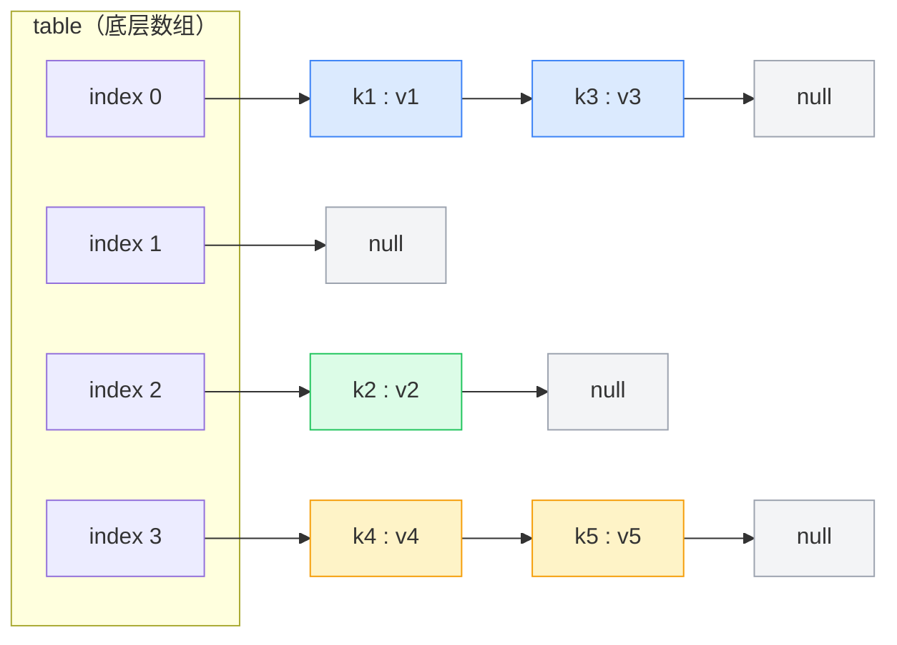
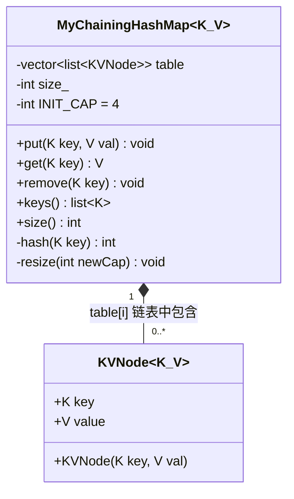
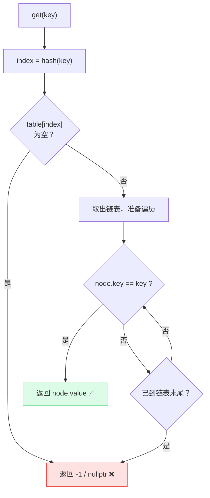
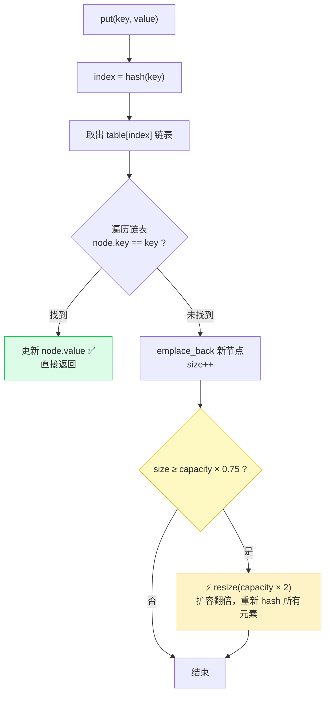
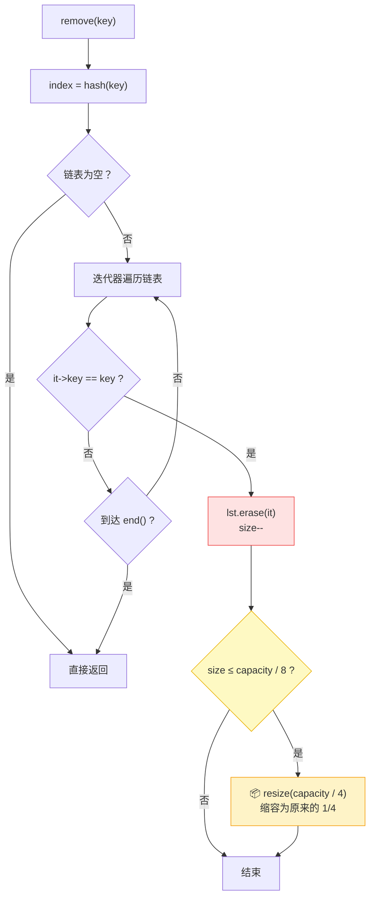
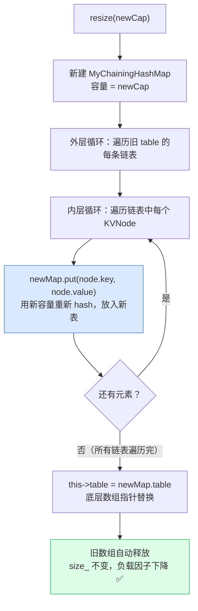
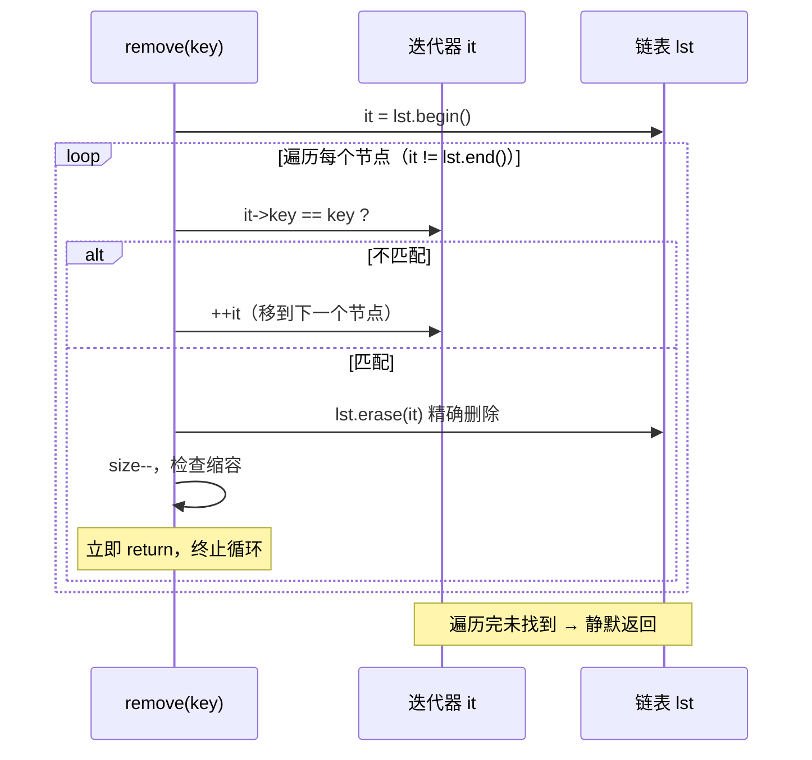
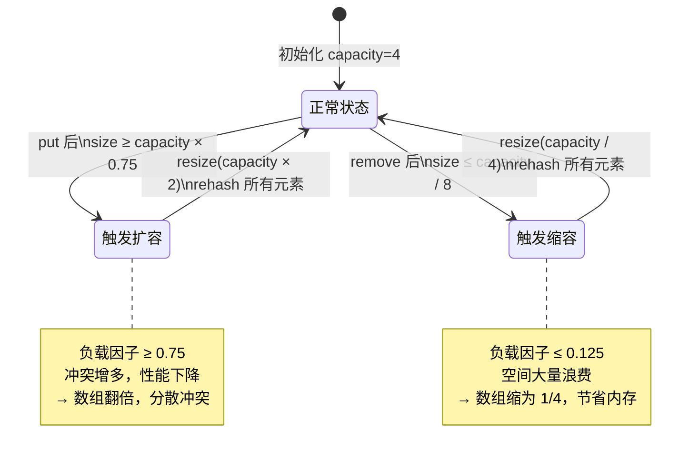

# 拉链法实现哈希表 — 学习笔记

---

## 一、前置回顾

上一篇笔记我们学了哈希表的核心原理，知道了：

- 哈希表 = 数组 + 哈希函数
- 哈希冲突不可避免
- 解决冲突有两种方法：**拉链法**和**线性探查法（开放寻址法）**

数组的优点是"知道索引就能 O(1) 访问"，但它只接受数字索引，不能直接用字符串或自定义类型当 key。哈希函数就是那座桥——把任意类型的 key 转成一个数字，再映射到数组索引。两者合体，才有了"什么类型都能当 key，查找还很快"的哈希表。

哈希冲突不是代码写得不好——想象全国有几亿种可能的字符串 key，但数组只有几百个格子，两个不同的 key 算出同一个索引，这在数学上叫"鸽巢原理"，格子比可能的 key 少，碰撞必然存在。重要的不是消灭冲突，而是"冲突了怎么办"。

*就像"柜子满了把东西摞高"和"柜子满了去找旁边空位"的区别*——拉链法选择前者，冲突的元素串成链表挂在同一格子里；线性探查法选择后者，冲突了就往后扫描找空位。本篇讲前者。

> ✅ 能把上一篇的两种冲突解决方式记清楚，说明基础打得很扎实，继续！

---

## 二、拉链法的核心思想

### 2.1 一句话概括

> 底层数组的每个位置不直接存 value，而是挂一个**链表**。多个 key 哈希到同一个位置时，它们的 key-value 对都串在这个链表上。

这句话看起来简单，但有一个关键点值得停下来想一想：数组里存的不再是数据本身，而是一条链表的"入口"。链表可以动态增长，所以这个格子永远不会"装满"——只要内存够，就能一直往链表里加节点。这是拉链法能处理任意多冲突的根本原因。

### 2.2 类比理解

想象一个学校的储物柜墙：

- 每个柜子编号就是数组索引（0, 1, 2, ...）
- 正常情况下，一个柜子放一个学生的东西
- 如果两个学生被分配到同一个柜子怎么办？**在柜子门上挂一串收纳袋**，每个袋子装一个学生的东西，袋子上写着学生的名字（key）
- 找东西时：先找到柜子（哈希函数算索引），再在收纳袋里按名字找（遍历链表）

"找东西"分成两步：第一步是 O(1)（直接跳到柜子），第二步是 O(链表长度)（挨个翻袋子）。只要每个柜子里的袋子数量不多，整体就是 O(1)。控制链表长度，就是控制性能的关键——这也是后面要讲负载因子的原因。

> 💡 **老师提醒：** 拉链法的每个格子存的是链表头指针，不是数据本身。链表节点是在堆内存里动态分配的，数组本身只是一排"入口地址"。第一次理解这个结构时，最好对着图看，不要只看代码。

### 2.3 底层数据结构

```
table 数组：
index 0: → [k1:v1] → [k3:v3] → null    （k1 和 k3 哈希冲突，都映射到 0）
index 1: → null                          （空的，没有元素）
index 2: → [k2:v2] → null               （只有一个元素）
index 3: → [k4:v4] → [k5:v5] → null     （k4 和 k5 哈希冲突）
...
```

每个数组元素是一个链表的头，链表里的每个节点都存着一个 key-value 对。从图里你能看到：index 1 是空的，但 index 0 和 index 3 各有两个节点——这就是冲突被"消化"的样子，数组本身没有变大，多出来的元素都长在链表上了。

<!-- 图结构：展示 table 数组与链表节点的组织关系 -->



> ✅ 核心思想就这一张图。能在脑子里把这张图画出来，你就掌握了拉链法的灵魂。

---

## 三、简化版实现（先理解核心逻辑）

学新东西最怕一下子看到太多细节。先把 key 和 value 都简化成 `int`，让你专注在"哈希 + 链表"这个核心上，不被泛型语法分心。这是一种很好的学习策略：先理解骨架，再填肉。

为了聚焦核心逻辑，先做几个简化：

| 简化项                    | 说明                               |
| ------------------------- | ---------------------------------- |
| key 和 value 都是 `int` | 不用泛型，降低理解难度             |
| 哈希函数 = 简单取模       | `hash(key) = key % table.size()` |
| 数组大小固定              | 不考虑扩缩容                       |
| key 不存在时返回 -1       | 简化返回值处理                     |

### 3.1 链表节点的设计

> 🌱 **最简单的例子**：用"快递单"来理解 `struct` 和构造函数

```cpp
struct Package {                          // 定义一种叫"包裹"的东西
    int id;                               // 包裹有一个快递单号字段
    int weight;                           // 包裹还有一个重量字段
    Package(int i, int w) : id(i), weight(w) {} // ⚠️ 构造函数：冒号后面叫"初始化列表"
                                          //    : id(i) 意思是"用传入的 i 来初始化 id"
                                          //    比在函数体里写 this->id = i 更高效
};
Package p(1001, 5);                       // 创建一个包裹，单号1001，重5斤
```

> 🔗 **过渡**：下面的 `KVNode` 做的事情完全一样——定义了一种"小标签"，每个标签上贴着一个 key（相当于快递单号，用来区分是谁的东西）和一个 value（相当于重量，就是要存的数据），构造函数写法完全相同。下面是加了注释的原始代码：

```cpp
struct KVNode {
    int key;    // 键：用来识别身份，相当于收纳袋上写的名字
    int value;  // 值：真正要存的数据内容
    KVNode(int key, int value) : key(key), value(value) {}
    // ⚠️ 冒号后面是"成员初始化列表"，格式：成员名(传入的参数名)
    //    : key(key) → 用参数 key 初始化成员变量 key
    //    : value(value) → 用参数 value 初始化成员变量 value
    //    两个同名但一个是参数、一个是成员，C++ 能区分，不会乱
};
```

**为什么要同时存 key 和 value？**

这个问题很关键，很多初学者会疑惑。因为哈希冲突，一个格子里可能挂着多个节点。你拿着 key 来查，需要逐个对比链表里的每个节点——如果节点只存 value 不存 key，你就无法判断"这个节点是不是我要找的那个"。key 就是节点的"身份证"，value 是它实际携带的内容。

> **类比**：收纳袋上必须写名字（key），不然你打开柜子看到一堆袋子，怎么知道哪个是你的？
> 💡 **老师提醒：** 构造函数里 `: key(key)` 的写法第一次看会很困惑——冒号两边用的是同一个名字 `key`。C++ 能区分它们：冒号左边（成员初始化列表里）是成员变量，括号里是构造函数参数，不会混淆。这不是 bug，是完全合法的 C++ 写法。

### 3.2 整体结构

> 🌱 **最简单的例子**：用"停车道"来理解 `vector<list<T>>` 嵌套容器

```cpp
#include <vector>
#include <list>
using namespace std;

vector<list<int>> grid(4);   // ⚠️ vector<list<int>>：4 格的格子墙，每格是一个链表
                              //    可以把它想成：4 个停车道，每个道能停多辆车
grid[0].push_back(10);       // 在第 0 格的链表末尾放入 10
grid[0].push_back(20);       // 同一格再放一个 20（两辆车停同一道，模拟哈希冲突）
// 现在 grid[0] 里是：10 → 20 → 结束
```

> 🔗 **过渡**：下面的类做的事情一样，只是格子墙里装的不是单个 `int`，而是完整的 `KVNode`（key+value 组合），并且加了一个"哈希函数"来计算新来的东西该放进哪一格。下面是加了注释的原始代码：

```cpp
class ExampleChainingHashMap {
    // ⚠️ vector<list<KVNode>>：二维嵌套容器
    //    外层 vector：固定格数的格子墙（数组），每格有一个编号（索引）
    //    内层 list：每格里的链表，用来存放哈希冲突时多余的元素
    //    每个链表节点：KVNode，同时携带 key 和 value
    vector<list<KVNode>> table;

public:
    // 构造函数：: table(capacity) 表示"建一个有 capacity 格的格子墙"
    // ⚠️ 这里用了初始化列表，capacity 就是格子总数
    ExampleChainingHashMap(int capacity) : table(capacity) {}

    // 哈希函数：把 key 变成格子编号
    int hash(int key) {
        return key % table.size(); // 取余，结果一定落在 [0, 格子总数) 范围内
                                   // 例：key=7，共4格 → 7%4=3 → 放第3格
    }
};
```

---

**C++ 知识点补充**：

- `vector<list<KVNode>>`：这是一个"二维"结构。外层是动态数组 `vector`，里面每个元素是一个 `list`（双向链表），链表里装的是 `KVNode`
- `list` 是 C++ 标准库提供的双向链表容器，头尾插入/删除都是 O(1)。为什么不用 `vector` 做内层链表？因为 `vector` 在中间插入/删除是 O(N)（需要整体移位），而 `list` 的节点彼此通过指针连接，插入/删除只需要改几个指针。*就像"排队站位"和"拉链连接"的区别：数组是紧密站位，挪走一个大家都得移位；链表是前后拉链，断开重接就好。*

> 💡 **老师提醒：** 哈希函数里写的是 `% table.size()`，不是写死的数字。扩容后数组大小变了，哈希函数的结果也会跟着变，用 `table.size()` 才能保证总是用当前大小取模，否则扩容之后元素全乱了。

<!-- 类图：展示 MyChainingHashMap 与 KVNode 的组合关系及各自的成员 -->



### 3.3 查找操作（get）

**思路**：

1. 用哈希函数算出 key 对应的数组索引
2. 去那个位置的链表里，挨个对比 key，找到就返回 value
3. 找不到就返回 -1

注意第 2 步之前有一个"链表是否为空"的检查。这是一个小优化——空链表直接返回，省去进入循环的开销。虽然循环对空链表也会立即结束，但显式的 `empty()` 检查让意图更清晰，读代码的人一眼就知道"空的情况已经处理了"。

> 🌱 **最简单的例子**：用"在名册上按名字查人"来理解范围 for 和引用

```cpp
#include <list>
#include <string>
using namespace std;

list<string> nameList = {"小明", "小红", "小亮"};  // 一个名字链表，就像一格里的链表

for (const auto& name : nameList) {  // ⚠️ const auto& ：只读地逐个取出名字，不拷贝
    if (name == "小红") {            //    const：我只看，不改它
        // 找到了！                   //    auto：自动推导类型为 string
    }                                 //    &：引用，不产生额外拷贝，省内存
}
```

> 🔗 **过渡**：下面的 `get()` 做的事情一模一样——在链表里逐个核对 `node.key == key`，找到就返回 `node.value`，遍历完还没找到就返回 -1。下面是加了注释的原始代码：

```cpp
int get(int key) {
    int index = hash(key);  // 第一步：用哈希函数算出该查第几格

    // 第二步：如果这格本来就是空的，不用找了，直接说没有
    if (table[index].empty()) {
        return -1;
    }

    // 第三步：这格里有东西，逐个对比名字（key）
    for (const auto& node : table[index]) {  // ⚠️ const auto&：只读遍历，不拷贝节点
        if (node.key == key) {
            return node.value;  // 找到了，把对应的 value 返回出去
        }
    }

    // 第四步：整条链表都翻完了也没找到，说明不存在
    return -1;
}
```

**C++ 语法说明**：

- `for (const auto& node : table[index])`：范围 for 循环，遍历链表中的每个节点
  - `const`：我们只读不改，加 const 更安全
  - `auto&`：自动推导类型，`&` 表示引用（不拷贝，直接访问原始数据）
  - 没有 `&` 的话，每次循环都会拷贝一份节点，浪费性能——尤其是当 key 或 value 是 `string` 这类大对象时，拷贝代价很明显

> 💡 **老师提醒：** `get()` 有两个正常的退出路径：① 在循环里找到了，`return node.value`；② 循环结束没找到，`return -1`。第一次读代码时容易只看到"最后那个 -1"，忽略循环里还有一个 `return`。两个出口都是合法的，这种写法在哈希表里很常见。

<!-- 流程图：get(key) 的完整执行路径 -->



### 3.4 插入/修改操作（put）

**思路**：

1. 算出索引
2. 遍历链表，看 key 是否已经存在
   - 存在 → 更新 value（哈希表的 key 是唯一的，不会有重复）
   - 不存在 → 在链表尾部添加新节点

为什么 key 必须唯一？因为哈希表的语义就是"字典"——一个词只有一个解释。如果允许重复 key，查的时候就不知道该返回哪个 value，整个结构就失去了意义。所以 `put` 遇到已有的 key 就**更新**，而不是追加，这是哈希表的核心约束。

> 🌱 **最简单的例子**：用"签到表更新姓名"来理解"找到就改，没找到就加"的逻辑

```cpp
#include <list>
#include <string>
using namespace std;

list<string> signIn = {"小明", "小红"};  // 已签到名单

string newName = "小亮";
bool found = false;
for (auto& name : signIn) {   // ⚠️ auto&（没有 const）：可以修改 name 的值
    if (name == newName) {    //    如果名单里已有这个人
        name = "小亮（已更新）"; // 直接改（相当于更新 value）
        found = true;
        break;
    }
}
if (!found) {
    signIn.push_back(newName); // 没找到就追加到末尾（相当于新插入）
}
```

> 🔗 **过渡**：下面的 `put()` 做的事情一模一样——先找 key 有没有在链表里，找到就更新 value，找不到就在尾部追加新节点。下面是加了注释的原始代码：

```cpp
void put(int key, int value) {
    int index = hash(key);  // 第一步：算出这对 key-value 该放进哪格

    // 第二步：如果这格是空的，不用查，直接装进去就行
    if (table[index].empty()) {
        table[index].push_back(KVNode(key, value));  // 创建节点放到链表尾部
        return;
    }

    // 第三步：这格里有其他元素，逐个检查 key 是否已经存在
    for (auto& node : table[index]) {  // ⚠️ auto&（无 const）：需要能修改 node.value
        if (node.key == key) {
            node.value = value;  // key 已存在：只更新 value，不插入新节点（保持 key 唯一）
            return;
        }
    }

    // 第四步：整条链表都没有这个 key，说明是新来的，追加到末尾
    table[index].push_back(KVNode(key, value));
}
```

**注意**：这里的 `for` 循环用的是 `auto&`（不带 const），因为我们可能要**修改** node 的 value。`put()` 里用 `auto&`，`get()` 里用 `const auto&`，区别就在于"要不要修改"——这是一个很容易犯的细节错误：如果你在 `put()` 里误写了 `const auto&`，编译器会在 `node.value = value` 这行报错，因为你声明了只读但又想改。

> 💡 **老师提醒：** 第二步的 `if (table[index].empty())` 是个优化捷径，可以省去空链表时多余的遍历。但就算删掉这个判断，代码逻辑仍然正确——空链表的 `for` 循环一次都不执行，最后的 `push_back` 同样有效。遇到"优化"和"正确"分开的代码，先理解正确性，再理解优化。

<!-- 流程图：put(key, value) 的完整执行路径，含扩容判断 -->



### 3.5 删除操作（remove）

**思路**：

1. 算出索引
2. 在链表中找到 key 对应的节点，删掉它

拉链法的删除比线性探查法简单很多——直接从链表里移除节点就行，不需要担心"破坏探查链"的问题。这也是拉链法的一个优点：增删操作相互独立，不会相互影响。

> 🌱 **最简单的例子**：用"从班级名单里删除一个同学"来理解 lambda 和 `remove_if`

```cpp
#include <list>
#include <string>
#include <algorithm>
using namespace std;

list<string> classNames = {"小明", "小红", "小亮"};

string target = "小红";
classNames.remove_if([target](const string& name) {  // ⚠️ lambda：临时创建的小函数
    return name == target;  // 返回 true 就删掉这个元素，返回 false 就保留
});                         // [target]：把外部变量 target 带进 lambda 里用
// 结果：小红被删掉，剩下 小明 → 小亮
```

> 🔗 **过渡**：下面的 `remove()` 做的是同一件事——用 lambda 告诉 `remove_if`"哪个节点的 key 匹配就删哪个"。`auto& lst` 是拿到对应格子的链表引用，`[key]` 是把外部的 key 变量带进 lambda 里用。下面是加了注释的原始代码：

```cpp
void remove(int key) {
    // ⚠️ auto& lst：lst 是链表的引用（别名），修改 lst 等于直接修改 table 里的链表
    //    变量名用 lst 而不是 list，是为了避免和 C++ 标准库的 std::list 名字冲突
    auto& lst = table[hash(key)];
    if (lst.empty()) {
        return;  // 这格是空的，根本没东西可删
    }

    // remove_if：遍历链表，把所有"让 lambda 返回 true 的节点"都删掉
    lst.remove_if([key](KVNode& node) {  // ⚠️ [key]：捕获外部变量 key，lambda 内部才能用它
        return node.key == key;          //    返回 true → 这个节点被删除
    });                                  //    返回 false → 这个节点保留
}
```

**C++ 语法说明**：

- `remove_if`：C++ `list` 的成员函数，删除所有满足条件的元素
- `[key](KVNode& node) { return node.key == key; }`：这是一个 **lambda 表达式**（匿名函数）
  - `[key]`：捕获外面的 `key` 变量，让 lambda 内部能用
  - `(KVNode& node)`：参数，链表中的每个节点
  - `return node.key == key`：如果节点的 key 匹配，返回 true，表示"删掉这个"

> **不熟悉 lambda？** 你可以把它理解成"当场定义的一个小函数，用完就扔，不需要起名字"。`[key]` 括号里放的是"我需要从外部借用哪些变量"，这叫"捕获"。lambda 的本质是让你把逻辑当参数传给函数，这在 C++ 里非常常用。
> 💡 **老师提醒：** `auto& lst = table[hash(key)]` 里的 `&` 极其重要。如果写成 `auto lst = ...`（没有 `&`），你拿到的是链表的一份**副本**，对它做的删除操作不会影响 `table` 里的真实链表——删了半天什么都没删掉，而且还不报错，这种 bug 极难发现。

<!-- 流程图：remove(key) 的完整执行路径，含缩容判断 -->



> ✅ 三个核心操作（get / put / remove）都看完了，每个都不超过 20 行。把这个结构记住，之后看完整版只是在这基础上加功能，骨架是一样的。

---

## 四、完整版实现（带扩缩容）

简化版让我们理解了核心逻辑，完整版在此基础上增加了：

1. **泛型支持**：key 和 value 可以是任意类型
2. **动态扩缩容**：根据负载因子自动调整数组大小
3. **完善的哈希函数**：处理负数、取模映射
4. **keys() 方法**：返回所有的 key

这四项改进各有意义，不是为了复杂而复杂。泛型让代码可复用；扩缩容让性能随元素数量稳定；完善的哈希函数处理边界情况（比如 key 是负数时，直接取模会得到负索引）；keys() 让外部代码能遍历整张表。

### 4.1 完整代码（带详细注释）

> 🌱 **最简单的例子**：用"万能收纳箱"来理解 `template`（泛型）和 `explicit`

```cpp
template<typename T>          // ⚠️ template<typename T>：T 是"占位符"，使用时再填入具体类型
class Box {                   //    就像说"我要一个装 T 的盒子"，T 可以是 int、string……
    T content;                // 盒子里装的东西，类型由 T 决定
public:
    explicit Box(T val) : content(val) {}  // ⚠️ explicit：禁止隐式转换，防止 Box b = 42; 这种写法
};                                          //    ⚠️ static constexpr 后面会用到：编译期确定的常量

Box<int>    b1(10);           // T=int，装整数的盒子
Box<string> b2("hello");      // T=string，装字符串的盒子
```

> 🔗 **过渡**：下面的 `MyChainingHashMap<K, V>` 是同样的思路，只是它是"装键值对的哈希表"，`K` 和 `V` 在使用时才确定类型。代码较长，每个逻辑块都加了注释，按块阅读即可：

```cpp
#include <iostream>
#include <memory>
#include <string>
#include <list>
#include <vector>

template<typename K, typename V>
class MyChainingHashMap {
    // 链表节点，存储 key-value 对
    struct KVNode {
        K key;
        V value;
        KVNode(K key, V val) : key(key), value(move(val)) {}
    };

    // 底层数组，每个元素是一个链表
    vector<list<KVNode>> table;

    // 当前存储的键值对数量
    int size_;

    // 初始容量
    static constexpr int INIT_CAP = 4;

    // 哈希函数
    int hash(K key) {
        // hash<K>{}(key)：调用 C++ 标准库的哈希函数
        // & 0x7fffffff：去掉符号位，保证非负
        // % table.size()：映射到合法索引范围
        return (std::hash<K>{}(key) & 0x7fffffff) % table.size();
    }

    // 扩缩容
    void resize(int newCap) {
        newCap = max(newCap, 1);  // 防止容量为 0
        MyChainingHashMap<K, V> newMap(newCap);

        // 把旧表中的所有键值对搬到新表
        for (auto& lst : table) {
            for (auto& node : lst) {
                newMap.put(node.key, node.value);
            }
        }

        // 用新表的底层数组替换旧的
        this->table = newMap.table;
    }

public:
    // 默认构造函数
    MyChainingHashMap() : MyChainingHashMap(INIT_CAP) {}

    // 指定初始容量的构造函数
    explicit MyChainingHashMap(int initCapacity) {
        size_ = 0;
        initCapacity = max(initCapacity, 1);
        table.resize(initCapacity);
    }

    // ======== 增/改 ========
    void put(K key, V val) {
        auto& lst = table[hash(key)];

        // 检查 key 是否已存在
        for (auto& node : lst) {
            if (node.key == key) {
                node.value = val;  // 已存在，更新
                return;
            }
        }

        // 不存在，插入新节点
        lst.emplace_back(key, val);
        size_++;

        // 负载因子 >= 0.75，扩容为原来的 2 倍
        if (size_ >= table.size() * 0.75) {
            resize(table.size() * 2);
        }
    }

    // ======== 删 ========
    void remove(K key) {
        auto& lst = table[hash(key)];

        for (auto it = lst.begin(); it != lst.end(); ++it) {
            if (it->key == key) {
                lst.erase(it);
                size_--;

                // 负载因子 <= 0.125，缩容为原来的 1/4
                if (size_ <= table.size() / 8) {
                    resize(table.size() / 4);
                }
                return;
            }
        }
    }

    // ======== 查 ========
    V get(K key) {
        const auto& lst = table[hash(key)];

        for (const auto& node : lst) {
            if (node.key == key) {
                return node.value;
            }
        }
        return nullptr;  // 未找到
    }

    // ======== 获取所有 key ========
    list<K> keys() {
        list<K> allKeys;
        for (const auto& lst : table) {
            for (const auto& node : lst) {
                allKeys.push_back(node.key);
            }
        }
        return allKeys;
    }

    int size() const {
        return size_;
    }
};
```

### 4.2 新增功能详解

#### 泛型（template）

> 🌱 **最简单的例子**：`template` 就是在说"类型先空着，用的时候再填"

```cpp
template<typename A, typename B>  // A、B 是类型占位符，就像函数参数里的变量名
struct Pair {                      // 定义一个"配对"结构，能装任意两种类型
    A first;
    B second;
};
Pair<int, string> p;   // 使用时：A=int，B=string，编译器自动生成对应版本
Pair<string, float> q; // 同一套代码，换个类型，又生成另一个版本
```

> 🔗 **过渡**：下面的写法完全一致，只是 `A`、`B` 换成了语义更清晰的 `K`（key 类型）和 `V`（value 类型）。

```cpp
template<typename K, typename V>
class MyChainingHashMap { ... };
// 使用：MyChainingHashMap<string, int> 表示 K=string，V=int
```

- `template<typename K, typename V>`：告诉编译器，K 和 V 是占位符，使用时再确定具体类型
- 这样同一套代码就能支持 `<string, int>`、`<int, string>` 等各种组合

没有模板的话，你就得为每种类型组合各写一个类——`StringIntHashMap`、`IntStringHashMap`……代码几乎相同，维护起来是噩梦。模板让编译器自动帮你生成这些版本，你只需要写一份源码。

> **类比**：模板就像一个"万能插座"，你不需要为每种插头做一个插座，只要一个万能的就够了。
> 💡 **老师提醒：** 模板是**编译期**生成代码的机制，不是运行时的多态。`MyChainingHashMap<string, int>` 和 `MyChainingHashMap<int, int>` 在编译后是两套完全独立的代码，只是你写的时候只写了一份源码。这意味着模板代码通常要写在头文件里，编译器需要在实例化时看到完整定义。

#### 动态扩缩容（resize）

扩缩容的触发条件：

| 操作   | 条件                                           | 动作         |
| ------ | ---------------------------------------------- | ------------ |
| 插入后 | `size >= capacity * 0.75`（负载因子 ≥ 75%） | 容量翻倍     |
| 删除后 | `size <= capacity / 8`（负载因子 ≤ 12.5%）  | 容量缩为 1/4 |

**扩缩容的过程**：

1. 创建一个新的、容量不同的哈希表
2. 把旧表中的所有键值对重新 `put` 到新表（因为容量变了，哈希函数的结果也变了，每个 key 的位置需要重新计算）
3. 用新表的底层数组替换旧表的

第 2 步是最容易忽视的关键点。容量从 4 变成 8 以后，`key % 4` 和 `key % 8` 的结果完全不同——原来在格子 2 的 key，扩容后可能跑到格子 6 了。所以不能只是"复制数组"，必须用新容量对每一个元素重新哈希并插入，这个过程叫 **rehash**。

> **类比**：停车场扩建了。车位从 10 个变成 20 个，每辆车的分配规则（车牌号 % 车位数）结果不同了，所以所有车都得重新分配车位。

<!-- 流程图：resize(newCap) 内部执行步骤，展示 rehash 的完整过程 -->



**为什么扩容阈值是 0.75？**

这是一个经验值，在"空间浪费"和"冲突频率"之间取了个平衡：

- 太小（比如 0.5）：空间浪费多，一半的位置都空着
- 太大（比如 0.9）：冲突太多，链表变长，查找变慢

Java 的 HashMap、Python 的 dict 都用了接近的值。实验数据表明，负载因子 0.75 时，每次查找的平均链表长度约为 1.33，是性能和空间的最优平衡点。

#### 删除操作中的迭代器用法

> 🌱 **最简单的例子**：用"手指在队伍里逐个点名，指到谁就让谁出列"来理解迭代器

```cpp
#include <list>
using namespace std;

list<int> q = {10, 20, 30, 40};

// auto it：it 是"迭代器"，就像一根手指指向链表中的某个元素
// begin() → 手指指向第一个；end() → 手指越过最后一个（哨兵，不可解引用）
for (auto it = q.begin(); it != q.end(); ++it) {  // ++it：手指往后移一格
    if (*it == 30) {          // *it：取出手指当前指向的值（30）
        q.erase(it);          // ⚠️ erase(it)：把手指指向的节点从链表里删掉
        break;                // 删完立刻停，迭代器已失效，不能继续用
    }
}
```

> 🔗 **过渡**：下面的迭代器写法完全一样，只是链表里装的是 `KVNode`，所以用 `it->key`（相当于 `(*it).key`）来访问节点的 key 字段，找到匹配的就 `erase` 掉，然后立即 `return` 以避免使用失效的迭代器。下面是加了注释的原始代码：

```cpp
for (auto it = lst.begin(); it != lst.end(); ++it) {
    if (it->key == key) {    // ⚠️ it->key 等价于 (*it).key：解引用迭代器再访问成员
        lst.erase(it);       // 精确删除迭代器指向的这个节点（O(1)）
        size_--;             // 记录数量减一
        return;              // 必须立即返回：erase 之后 it 已失效，不能再用
    }
}
```

**C++ 语法说明**：

- `auto it = lst.begin()`：`it` 是一个**迭代器**，你可以把它理解成一个"指向链表中某个节点的指针"
- `it->key`：通过迭代器访问节点的 key 字段（等价于 `(*it).key`）
- `lst.erase(it)`：删除迭代器指向的那个节点
- 为什么不用 `remove_if`？因为完整版删除后还要做缩容等操作，用迭代器更灵活

> **迭代器类比**：迭代器就像你的手指，指着链表中的某个节点。`begin()` 是指向第一个节点，`end()` 是指向链表结尾的"虚拟位置"（表示遍历结束），`++it` 是手指往后移一个节点。
> 💡 **老师提醒：** `lst.erase(it)` 之后，`it` 就"失效"了——它指向的内存已经被释放，继续用会产生未定义行为（可能崩溃，也可能静默输出乱码，最难调试的那种错误）。所以 `erase` 之后必须立刻 `return`，或者使用 `erase` 的返回值——它会返回被删元素的下一个有效迭代器，这在需要继续遍历的场景下很有用。

<!-- 序列图：迭代器在链表上的遍历与删除时序 -->



> ✅ 完整版的四个新增功能都搞清楚了：泛型让类型灵活，resize 让性能稳定，迭代器让删除精准。这是工业级哈希表的基本样子。

---

## 五、增删查改操作流程总结

把每个操作的步骤压缩成流程，方便你快速复习时查阅。理解之后，这几段伪代码就是你的速查手册——遇到类似题目，脑子里先跑一遍这个流程，再动手写代码。

### 5.1 get(key) 查找流程

```
key → hash(key) 算出索引 index
       ↓
table[index] 取出链表
       ↓
遍历链表，逐个对比 node.key == key？
       ↓
找到 → 返回 node.value
没找到 → 返回 -1 / nullptr
```

### 5.2 put(key, value) 插入/修改流程

```
key → hash(key) 算出索引 index
       ↓
table[index] 取出链表
       ↓
遍历链表，看 key 是否已存在？
       ↓
已存在 → 更新 value，结束
不存在 → 在链表尾部添加新节点，size++
       ↓
检查负载因子，是否需要扩容？
  size >= capacity * 0.75 → 扩容（容量翻倍）
```

### 5.3 remove(key) 删除流程

```
key → hash(key) 算出索引 index
       ↓
table[index] 取出链表
       ↓
遍历链表，找到 key 匹配的节点
       ↓
找到 → 删除该节点，size--
       ↓
检查负载因子，是否需要缩容？
  size <= capacity / 8 → 缩容（容量变为 1/4）
```

<!-- 状态图：哈希表的扩缩容生命周期，展示负载因子触发的状态转移 -->



---

## 六、时间复杂度分析

| 操作   | 平均情况 | 最坏情况 |
| ------ | -------- | -------- |
| get    | O(1)     | O(N)     |
| put    | O(1)     | O(N)     |
| remove | O(1)     | O(N)     |

**为什么平均是 O(1)？**

关键词是"均匀"。一个好的哈希函数会把 key 分散到各个格子，而不是让大家挤在一起。`& 0x7fffffff` 和 `% table.size()` 的设计，正是为了让结果尽量均匀分布。

负载因子控制在 0.75 以下，是"自动维护均匀"的机制。你每次插入删除，代码都在监控这个比例，一旦超标就扩容——扩容让格子变多，每个格子分到的 key 变少，链表自然变短。自动扩缩容就是在守护 O(1) 的性能。

所以遍历链表的时间可以看作 O(1)——不是说链表只有一个节点，而是说平均长度是个接近 1 的常数，不随 N 增长。

**什么时候退化成 O(N)？**

所有 key 都哈希到同一个位置（极端情况），链表变成一条长链，查找就变成了遍历整个链表，复杂度 O(N)。在竞赛中，有一种叫"哈希碰撞攻击"（hash flooding）的手段——故意构造大量 key 使它们全部碰撞到同一个格子，让 `unordered_map` 退化到 O(N)。遇到这种情况，切换到有序的 `map`（红黑树，O(log N) 保证）可以规避。

> **类比**：正常情况下，每个柜子只挂了 1-2 个收纳袋，找东西很快。但如果所有人的东西都被分配到了同一个柜子，那个柜子上挂了 N 个袋子，你就得一个一个翻，这就是 O(N)。
> 💡 **老师提醒：** 理解了最坏情况，你就能理解竞赛里为什么有时候要"换掉 unordered_map"——不是因为它不好，而是要应对最坏情况。`map` 慢一点（O(log N) vs O(1)），但它不会被卡死。知道什么时候换，是理解底层原理最直接的收益。
> ✅ 时间复杂度不只是一个数字，它背后是"为什么均匀""为什么扩容""为什么最坏 O(N)"这三个问题的答案。能解释清楚这三点，这部分就真的掌握了。

---

## 七、竞赛中的实际应用

在竞赛编程中，你**不需要自己实现哈希表**，直接用 C++ 标准库就行：

> 🌱 **最简单的例子**：把 `unordered_map` 当成一个"自动管理的魔法字典"来用

```cpp
#include <unordered_map>
#include <iostream>
using namespace std;

unordered_map<string, int> score;  // 声明：key 是 string（名字），value 是 int（分数）
score["小明"] = 95;                // 相当于 put("小明", 95)，不存在就新建，存在就更新
score["小红"] = 88;
cout << score["小明"];             // 相当于 get("小明")，输出 95
score.erase("小红");               // 相当于 remove("小红")
if (score.count("小亮") == 0) {   // count(key)：存在返回1，不存在返回0（只会是这两个值）
    cout << "小亮不在名单里";
}
```

> 🔗 **过渡**：下面的代码就是把上面"小明/小红"换成了整数 key 和 value，所有操作和这个例子一一对应。下面是加了注释的原始代码：

```cpp
#include <unordered_map>
using namespace std;

unordered_map<int, int> mp;       // 声明一个 key=int，value=int 的哈希表
mp[1] = 100;          // put(1, 100)：向哈希表写入键值对
cout << mp[1];        // get(1)：通过 key 取出对应的 value，输出 100
mp.erase(1);          // remove(1)：删除 key=1 的那条记录
mp.count(1);          // 判断 key 1 是否存在：存在返回 1，不存在返回 0
                      // ⚠️ 不要用 mp[1] 来判断存在性！mp[1] 会自动插入 key=1（value 默认为 0）
```

**但理解底层原理很重要**，因为：

1. 面试会问哈希表的实现原理。不只是"背一遍"，面试官通常会追问：为什么负载因子是 0.75？扩容时为什么要 rehash？如果你真正理解了本篇笔记的内容，这些问题对你来说是自然而然的。
2. 理解了原理，你才知道什么时候该用 `unordered_map`，什么时候该用 `map`。`unordered_map` 平均 O(1) 但无序；`map` 保证 O(log N) 且有序。如果你需要按 key 排序输出，或者 key 的哈希函数很差，`map` 是更好的选择。*就像"快递按区域分拣"和"图书馆按字母排架"的区别——前者快但无序，后者慢一点但能按顺序找。*
3. 竞赛中如果 `unordered_map` 被卡（恶意构造哈希冲突导致 O(N)），你得知道为什么，以及如何切换到 `map`。这种"知道为什么"的能力，才是学底层实现最大的收获。

> 💡 **老师提醒：** `mp[1]` 有一个陷阱：如果 key 不存在，它会**自动插入**这个 key，value 默认为 0。所以绝对不要写 `if (mp[key] == 0)` 来判断 key 是否存在——这会污染你的哈希表。正确用法是 `mp.count(key)` 或 `mp.find(key) != mp.end()`。
> ✅ 能直接用标准库，也能解释它背后的原理——这才是真正学会了。以后每次用 `unordered_map`，脑子里有那张"数组 + 链表"的图，用起来就会更有把握。

---

## 八、关键 C++ 知识点回顾

回顾一遍这些语法，如果哪个还有点陌生，回去找对应的代码块再看一眼。每个语法都是真实需要用到的，不是为了让代码看起来复杂——你能在本篇的每一个操作里找到它们的实际用途。

本篇出现了不少 C++ 新语法，这里集中总结一下：

| 语法                          | 含义                    | 示例                                       |
| ----------------------------- | ----------------------- | ------------------------------------------ |
| `vector<list<KVNode>>`      | 数组套链表的二维结构    | 哈希表的底层存储                           |
| `for (auto& x : container)` | 范围 for 循环，遍历容器 | 遍历链表中的每个节点                       |
| `const auto&`               | 只读引用，不拷贝不修改  | 查找时遍历                                 |
| `auto&`                     | 可写引用，不拷贝可修改  | 需要修改 value 时                          |
| `it->key`                   | 迭代器访问成员          | 等价于 `(*it).key`                       |
| `lst.erase(it)`             | 用迭代器删除元素        | 精确删除链表中的某个节点                   |
| `[x](Type& y) { ... }`      | lambda 表达式           | 传给 `remove_if` 的条件函数              |
| `template<typename K, V>`   | 模板/泛型               | 让类支持任意类型                           |
| `emplace_back(args...)`     | 直接在容器末尾构造对象  | 比先构造再 push_back 更高效                |
| `static constexpr`          | 编译期常量              | `INIT_CAP = 4`                           |
| `explicit`                  | 禁止隐式类型转换        | 防止 `MyChainingHashMap m = 4;` 这种写法 |

> ✅ 这 11 个语法点覆盖了 C++ 容器操作、泛型编程和现代 C++ 特性的核心入门内容。把这张表当检查清单，每个都能结合代码解释清楚，说明本篇真的读懂了。

---

## 九、知识图谱

```
拉链法实现哈希表
├── 底层结构：vector<list<KVNode>>（数组 + 链表）
├── KVNode 节点
│   ├── 必须同时存 key 和 value
│   └── 通过 key 区分同一链表中的不同元素
├── 核心操作
│   ├── get：算索引 → 遍历链表找 key → 返回 value
│   ├── put：算索引 → 遍历链表查重 → 更新或插入 → 检查扩容
│   └── remove：算索引 → 遍历链表找 key → 删除 → 检查缩容
├── 扩缩容
│   ├── 扩容条件：size >= capacity * 0.75
│   ├── 缩容条件：size <= capacity / 8
│   └── 过程：新建更大/更小的表 → 重新哈希所有元素 → 替换旧表
├── 时间复杂度
│   ├── 平均 O(1)（负载因子控制得当，链表短）
│   └── 最坏 O(N)（所有 key 冲突到同一位置）
└── 竞赛实践
    └── 直接用 unordered_map，但要理解原理
```
