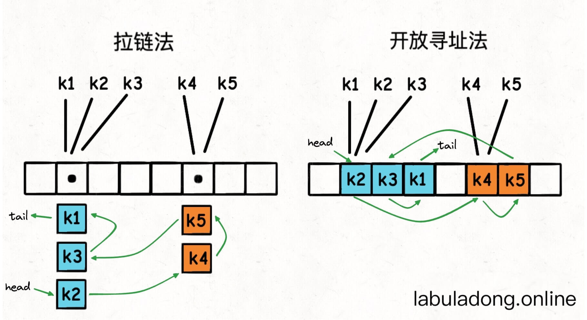
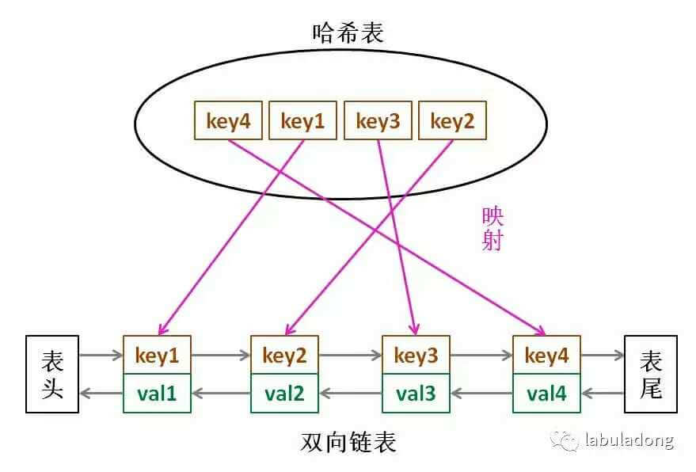

# 哈希链表（LinkedHashMap）学习笔记

> **前置知识**：哈希表的基本原理（数组 + 哈希函数 + 解决冲突）
> **核心问题**：普通哈希表的 key 是无序的，我们能不能让 key **按插入顺序**排列，同时不影响 O(1) 的增删查改？
> **答案**：可以！用一个**双链表**把所有键值对串起来，就得到了「哈希链表」。

---

## 一、为什么需要哈希链表？

### 1.1 普通哈希表的问题

普通哈希表（`unordered_map`）内部是一个数组，key 通过哈希函数被分散存储到不同位置。

**类比**：想象一个大型停车场，每辆车（key）根据车牌号被分配到某个车位。你没法通过走一遍停车场来还原「这些车是按什么顺序开进来的」——因为车位的分配跟到达顺序无关。

所以普通哈希表：

- ✅ 查找、插入、删除都是 O(1)
- ❌ 无法按插入顺序遍历所有 key
- ❌ 一旦扩容，key 的位置还会变

### 1.2 我们想要什么？

> 一种数据结构，**既有哈希表 O(1) 的增删查改能力**，**又能按照插入顺序遍历所有 key**。

这就是 **LinkedHashMap（哈希链表）**。





---

## 二、核心思路：哈希表 + 双链表

### 2.1 直觉理解

**类比**：还是停车场的例子。这次我们在停车场门口放了一本「签到簿」（双链表）。每辆车进来时，除了停到指定车位（哈希表插入），还要在签到簿末尾签上名字（链表尾部追加）。

这样：

- 想找某辆车？→ 通过车牌号直接去车位（哈希表 O(1) 查找）
- 想知道到达顺序？→ 翻签到簿从头看到尾（链表顺序遍历）
- 某辆车要走？→ 从车位移走（哈希表删除），同时把签到簿上对应的名字划掉（链表删除）

### 2.2 结构设计

把普通哈希表的「值」包装成一个**双链表节点**：

```
普通哈希表:    key  →  value
哈希链表:      key  →  Node(key, value, prev, next)
```

所有 Node 通过 `prev` 和 `next` 指针串成一条双链表，并持有 `head`（头哨兵）和 `tail`（尾哨兵）。

**示意图**：

```
哈希表部分（快速查找）：
  map["k2"] ──→ Node(k2)
  map["k4"] ──→ Node(k4)
  map["k5"] ──→ Node(k5)

双链表部分（维护插入顺序）：
  head ↔ Node(k2) ↔ Node(k4) ↔ Node(k5) ↔ tail
  
  插入顺序就是: k2 → k4 → k5
```

### 2.3 为什么必须用「双链表」而不是「单链表」？

删除一个节点时，需要修改它**前面那个节点**的 `next` 指针。

- **双链表**：节点自己就有 `prev` 指针，直接找到前驱，O(1) 删除
- **单链表**：没有 `prev` 指针，必须从头遍历才能找到前驱，O(n) 删除

所以为了保证删除操作是 O(1)，必须用双链表。

---

## 三、各操作的复杂度分析

| 操作                             | 哈希表部分       | 链表部分               | 总复杂度       |
| -------------------------------- | ---------------- | ---------------------- | -------------- |
| **查找** `get(key)`      | O(1) 找到 Node   | 直接读 Node.val        | **O(1)** |
| **插入** `put(key, val)` | O(1) 放入 map    | O(1) 追加到链表尾部    | **O(1)** |
| **删除** `remove(key)`   | O(1) 从 map 删除 | O(1) 双链表指针操作    | **O(1)** |
| **按序遍历** `keys()`    | —               | O(n) 从 head 走到 tail | **O(n)** |

关键点：所有操作的复杂度都和普通哈希表一样，只是额外加了一个链表来维护顺序。

---

## 四、C++ 代码实现 + 逐行解读

### 4.1 双链表节点定义

```cpp
template <typename K, typename V>
struct Node {
    K key;
    V val;
    Node* next;   // 指向链表中的下一个节点
    Node* prev;   // 指向链表中的上一个节点

    Node(K key, V val) : key(key), val(val), next(nullptr), prev(nullptr) {}
};
```

**C++ 知识点**：

- `template <typename K, typename V>`：模板，让这个结构体支持任意类型的 key 和 value（类似 Python 的泛型）
- `: key(key), val(val), ...`：初始化列表，C++ 构造函数中初始化成员变量的标准写法
- `nullptr`：C++ 中的空指针（相当于 Python 的 `None`）

### 4.2 哈希链表类整体结构

```cpp
template <typename K, typename V>
class MyLinkedHashMap {
private:
    Node<K, V>* head;    // 哨兵头节点（不存数据，只做标记）
    Node<K, V>* tail;    // 哨兵尾节点（不存数据，只做标记）
    unordered_map<K, Node<K, V>*> map;  // 哈希表：key → 链表节点指针

    // ... 私有方法（链表操作）
public:
    // ... 公有方法（对外接口）
};
```

**什么是哨兵节点？**

**类比**：就像书的封面和封底。封面和封底本身不是书的内容，但有了它们，你就不用特殊处理「第一页」和「最后一页」的情况了。

哨兵节点 `head` 和 `tail` 不存实际数据，但让代码更简洁——不需要处理「链表为空」「插入第一个元素」等边界情况。

### 4.3 构造函数和析构函数

```cpp
MyLinkedHashMap() {
    head = new Node<K, V>(K(), V());   // 创建哨兵头节点
    tail = new Node<K, V>(K(), V());   // 创建哨兵尾节点
    head->next = tail;                  // head 和 tail 互相连接
    tail->prev = head;                  // 初始时链表为空，只有哨兵
}
```

初始状态：`head ↔ tail`（中间没有数据节点）

```cpp
~MyLinkedHashMap() {
    // 遍历并释放所有数据节点
    Node<K, V>* current = head->next;
    while (current != tail) {
        Node<K, V>* next = current->next;
        delete current;       // 释放内存
        current = next;
    }
    delete head;
    delete tail;
}
```

**C++ 知识点**：

- `new` 和 `delete`：C++ 的手动内存管理。Python 有垃圾回收机制不用管，但 C++ 中 `new` 出来的东西必须 `delete`，否则内存泄漏
- `~MyLinkedHashMap()`：析构函数，对象被销毁时自动调用，负责清理资源
- `K()` 和 `V()`：调用类型的默认构造函数，比如 `int()` 得到 `0`，`string()` 得到 `""`

### 4.4 核心私有方法：链表操作

#### 尾部插入

```cpp
void addLastNode(Node<K, V>* x) {
    Node<K, V>* temp = tail->prev;  // temp 是当前最后一个数据节点
    // 原来: temp ↔ tail
    // 目标: temp ↔ x ↔ tail
  
    x->next = tail;
    x->prev = temp;
    temp->next = x;
    tail->prev = x;
}
```

**图解**（插入节点 x）：

```
插入前:  ... ↔ temp ↔ tail
插入后:  ... ↔ temp ↔ x ↔ tail
```

#### 删除任意节点

```cpp
void removeNode(Node<K, V>* x) {
    Node<K, V>* prev = x->prev;
    Node<K, V>* next = x->next;
    // 原来: prev ↔ x ↔ next
    // 目标: prev ↔ next（x 被跳过）
  
    prev->next = next;
    next->prev = prev;
    x->next = x->prev = nullptr;  // 断开 x 的指针（安全起见）
}
```

**图解**（删除节点 x）：

```
删除前:  ... ↔ prev ↔ x ↔ next ↔ ...
删除后:  ... ↔ prev ↔ next ↔ ...   (x 被摘出来了)
```

**这就是为什么删除是 O(1)**：我们已经拿到了节点 `x` 本身（通过哈希表直接找到），再加上双链表有 `prev` 指针，4 行指针操作就搞定了。

### 4.5 核心公有方法

#### get —— 查找

```cpp
V get(K key) {
    if (map.find(key) == map.end()) {
        return V();    // key 不存在，返回默认值
    }
    return map[key]->val;  // 通过哈希表找到节点，取出 val
}
```

**C++ 知识点**：

- `map.find(key)`：在 `unordered_map` 中查找 key，返回迭代器
- `map.end()`：指向容器「末尾之后」的迭代器。`find` 返回 `end()` 表示没找到
- `map[key]->val`：`map[key]` 得到 `Node*`（节点指针），`->` 是通过指针访问成员

#### put —— 插入/更新

```cpp
void put(K key, V val) {
    if (map.find(key) == map.end()) {
        // key 不存在 → 新插入
        Node<K, V>* node = new Node<K, V>(key, val);
        addLastNode(node);   // 加入链表尾部
        map[key] = node;     // 加入哈希表
        return;
    }
    // key 已存在 → 只更新 value
    map[key]->val = val;
}
```

#### remove —— 删除

```cpp
void remove(K key) {
    if (map.find(key) == map.end()) {
        return;  // key 不存在，啥也不做
    }
    Node<K, V>* node = map[key];
    map.erase(key);      // 从哈希表中删除
    removeNode(node);    // 从链表中删除
    delete node;         // 释放内存
}
```

**C++ 知识点**：

- `map.erase(key)`：从 `unordered_map` 中删除键值对

#### keys —— 按插入顺序获取所有 key

```cpp
vector<K> keys() {
    vector<K> keyList;
    // 从 head 的下一个开始（跳过哨兵），走到 tail 之前（跳过哨兵）
    for (Node<K, V>* p = head->next; p != tail; p = p->next) {
        keyList.push_back(p->key);
    }
    return keyList;
}
```

这里遍历的就是双链表，所以得到的顺序就是插入顺序。

---

## 五、完整使用示例

```cpp
int main() {
    MyLinkedHashMap<string, int> map;
    map.put("a", 1);
    map.put("b", 2);
    map.put("c", 3);
    map.put("d", 4);
    map.put("e", 5);

    // 输出: a b c d e（按插入顺序！）
    for (const auto& key : map.keys()) {
        cout << key << " ";
    }
    cout << endl;

    map.remove("c");

    // 输出: a b d e（c 被删除了，其他顺序不变）
    for (const auto& key : map.keys()) {
        cout << key << " ";
    }
    cout << endl;

    return 0;
}
```

---

## 六、Golang map 遍历顺序为什么每次不同？

文中提到 Go 的 map 每次遍历顺序都是随机的。这其实是 **Go 语言故意设计的**：

Go 在遍历 map 时会**随机选择起始位置**，目的就是让开发者**不要依赖遍历顺序**。如果每次顺序都一样，有人可能会不小心写出依赖这个顺序的代码，但这个顺序其实是不保证的，未来可能因为实现变化而改变。所以 Go 直接把它搞成随机的，强制你不要依赖它。

**类比**：就像老师批卷子时故意每次打乱试卷顺序，防止你以为「我交的早就改的早」。

---

## 七、LinkedHashSet

**一句话**：LinkedHashSet 就是 LinkedHashMap 的简化版——只要 key，不要 value。

实现方式：直接包装 LinkedHashMap，把 value 设为一个固定的无意义值就行。

```cpp
// 伪代码思路
class LinkedHashSet<K> {
    MyLinkedHashMap<K, bool> map;  // value 用 bool 占位

    void add(K key) { map.put(key, true); }
    void remove(K key) { map.remove(key); }
    bool contains(K key) { return map.containsKey(key); }
};
```

---

## 八、关键概念速查表

| 概念                      | 说明                                                        |
| ------------------------- | ----------------------------------------------------------- |
| **哈希表**          | key → value 的映射，增删查改 O(1)，但 key 无序             |
| **双链表**          | 每个节点有 prev 和 next 指针，支持 O(1) 的任意位置插入/删除 |
| **哈希链表**        | 哈希表 + 双链表的组合，既有 O(1) 操作，又能按序遍历         |
| **哨兵节点**        | 不存数据的 head/tail 节点，简化边界处理                     |
| **模板 (template)** | C++ 泛型机制，让类/函数支持多种数据类型                     |
| **析构函数**        | C++ 中对象销毁时自动调用，用来释放 `new` 出来的内存       |

---

## 九、竞赛中的应用场景

哈希链表在竞赛中最经典的应用是 **LRU Cache（最近最少使用缓存）**，这也是 LeetCode 上的经典题目（LeetCode 146）。

LRU Cache 的思路和哈希链表几乎一样，只是多了一个「容量限制」和「每次访问时把节点移到最前面」的操作。学会了本文的内容，LRU Cache 就是一道顺水推舟的题目。

---

## 十、练习建议

1. **先理解原理**：确保你能在纸上画出「插入 3 个 key 后链表的样子」以及「删除中间一个 key 后链表的变化」
2. **自己实现一遍**：不看代码，试着自己用 C++ 写一个简化版的 LinkedHashMap
3. **做 LeetCode 146 (LRU Cache)**：这是哈希链表最经典的应用题
4. **做 LeetCode 460 (LFU Cache)**：进阶版，需要多个链表配合哈希表

---

*笔记整理时间：2026-03-16*
