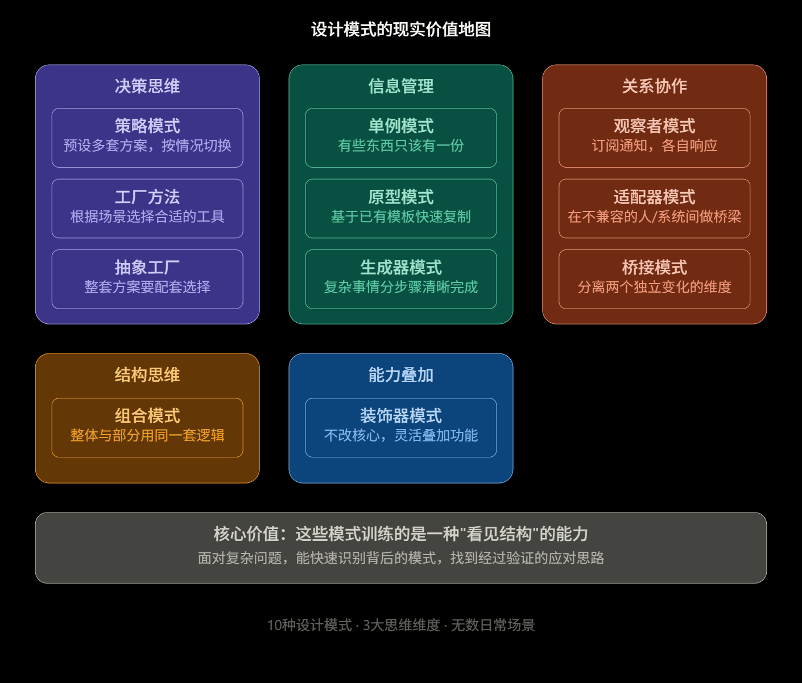

这是个很有趣的问题！你给的文档讲的是软件工程里的设计模式，但这些思维模式本质上是人类解决复杂问题的通用智慧——只是借用了代码的外壳来表达。让我帮你分析一下它们对日常生活真正有价值的地方。

这个问题问得很深，答案是： **学设计模式最大的隐藏价值，不是学会写代码，而是训练了一种"识别结构"的元认知能力** 。下面我结合你的文档，拆开来说。

---

## 一、每个模式背后藏的是一个通用生活智慧

### 单例模式 → "有些东西只该有一份"

文档的类比是"公司只有一台打印机"。生活里呢？

* 家里的路由器密码、家庭账单、孩子的学校联系方式——这些信息如果每个人各自维护一份， **必然会出现数据冲突** 。聪明的做法是指定一个"权威来源"，其他人引用它而不是复制它。
* 团队协作时，**"只有一个决策者"**也是单例思维。两个人同时拍板同一件事，会产生"两个实例"互相矛盾的问题。

### 观察者模式 → "订阅-通知"机制比主动轮询更高效

文档里的类比是报纸订阅：报社出报才派送，不需要读者每天跑去问。

* 你和老板、朋友的信息同步方式就是这个模式。**好的关系**是"有事通知我"（观察者），而不是"我每小时查一次你的状态"（轮询）——后者既低效又令人窒息。
* 工作汇报机制：下级注册成观察者，有重要进展才触发通知，而不是老板每5分钟问"做完了吗"。文档说的"内存泄漏"（忘记注销观察者）在生活里对应的是—— **关系结束了但通知链没有断开** ，比如前东家还在你的紧急联系人名单里。

### 策略模式 → "面对同一件事，预设多套方案，按情境切换"

文档里说的是导航软件：从A到B，可以选最快/最短/避高速，随时切换，导航软件本身不用改。

* 面试时回答同一问题，面对技术背景面试官 vs 产品背景面试官， **表达策略完全不同** 。提前把两套方案都封装好（想清楚），切换时不慌乱——这就是策略模式。
* 处理冲突：你预先设计好"温和沟通策略"、"直接对话策略"、"第三方调解策略"，根据对方和场景切换，而不是每次都现想。文档说的"消除if-else"在生活里意味着 **不再临场慌乱地即兴发挥** 。

### 装饰器模式 → "不改核心，往外叠加功能"

文档的类比是咖啡加料：黑咖啡是核心，加牛奶变拿铁，加糖变甜拿铁，每层不改变内核。

* **个人技能叠加**就是这个逻辑。你的核心技能是写代码，外面套一层"沟通能力装饰器"，再套一层"英语装饰器"，再套一层"行业知识装饰器"——价值指数级增长，但每一层都可以独立拆卸，不影响核心。
* 文档里说的"中间件链"（日志→认证→业务）在生活里对应： **日常习惯的模块化叠加** 。晨跑是一个模块，冥想套在外面，阅读再套一层——你可以随时取消某一层，不影响其他层。

### 适配器模式 → "在不兼容的人/系统之间做翻译官"

文档的类比是转换插头：你的充电器和英国插座各有各的标准，适配器居中转换，谁都不用改。

* **跨部门协作**时你经常扮演这个角色：研发讲技术语言，市场讲用户语言，你在中间做"TranslatorAdapter"，把技术方案翻译成商业价值，把用户需求翻译成需求文档。
* 适配器模式的核心前提是 **接口不兼容但都没有错** ——用在人际关系上，这意味着两个人的沟通方式不同，不是谁的问题，需要一个适配层（换种表达方式）。

---

## 二、最有价值的元能力：识别"维度独立性"

文档里桥接模式讲了一个重要洞见：

> 消息类型 × 发送渠道 = 类爆炸。如果两个维度独立变化，就应该分开管理，而不是让它们纠缠在一起。

这个思维在生活里极为有用——

* **职业规划** ：技能的深度（纵向）和行业的广度（横向）是两个独立维度，不应该混在一起评估。"我是不是应该跳槽"这个问题，需要分开问："我的技能深度够了吗？"和"我在对的行业吗？"
* **做任何决策**时，先问自己： **这个问题里有几个独立变化的维度** ？把它们分离出来，分别评估，才不会被复杂性淹没。

---

## 三、生成器模式 → 把"参数地狱"变成清晰的步骤

文档里的类比是网购定制：不需要一口气填完所有参数，按区块分步勾选，最后确认。

* **制定任何计划** （旅行计划、项目方案、年度目标）都有"必填项"和"选填项"。生成器思维提醒你：先把必填项固定（目的地、时间、预算），再按需叠加选填项（住哪、玩什么），而不是一上来就陷入所有细节的泥潭。
* 文档里说 `build()` 时统一做参数校验——在生活里对应的是 **延迟决策点** ：在所有信息收集完毕之前，先不做最终决定，等 `build()` 时一次性评估。

---

## 四、组合模式 → 整体和部分用同一套逻辑

文档的类比是按快递包裹里的"统一称重按钮"：不管里面是物品还是嵌套的盒子，都按一下，自动递归算出重量。

* **管理团队**时，这个模式意味着：你对一个人用的管理方法，和对一个小组用的管理方法，应该是同构的。你对小组的期望（明确目标、及时反馈、给予空间），也适用于每一个成员。用不同逻辑管理不同层级，是痛苦的来源。
* **个人成长** ：你的某项技能，往下可以拆解成若干子技能，往上又是某个大能力的组成部分。好的学习计划是分形的——大目标和小任务共享同一套"是否完成"的评估逻辑。

---

## 五、一个更重要的结论

你的文档里有一句话值得拿出来单独看，在策略模式那篇：

> 消除if-else：用多态替代条件分支。

在代码里，`if-else` 的爆炸代表的是 **临场即兴、没有预设结构** 。在生活里，遇到任何情况都"看当时状态再说"的人，其实就是活在一个巨大的 `if-else` 里——压力越来越大，越来越难维护。

设计模式训练你的，是在**事前**识别变化点，建立结构，让未来的变化可以在已有框架内优雅地发生，而不是每次都推倒重来。

这个能力—— **预见变化、提前建结构、分离关注点** ——是工程思维给日常生活最深层的馈赠。
